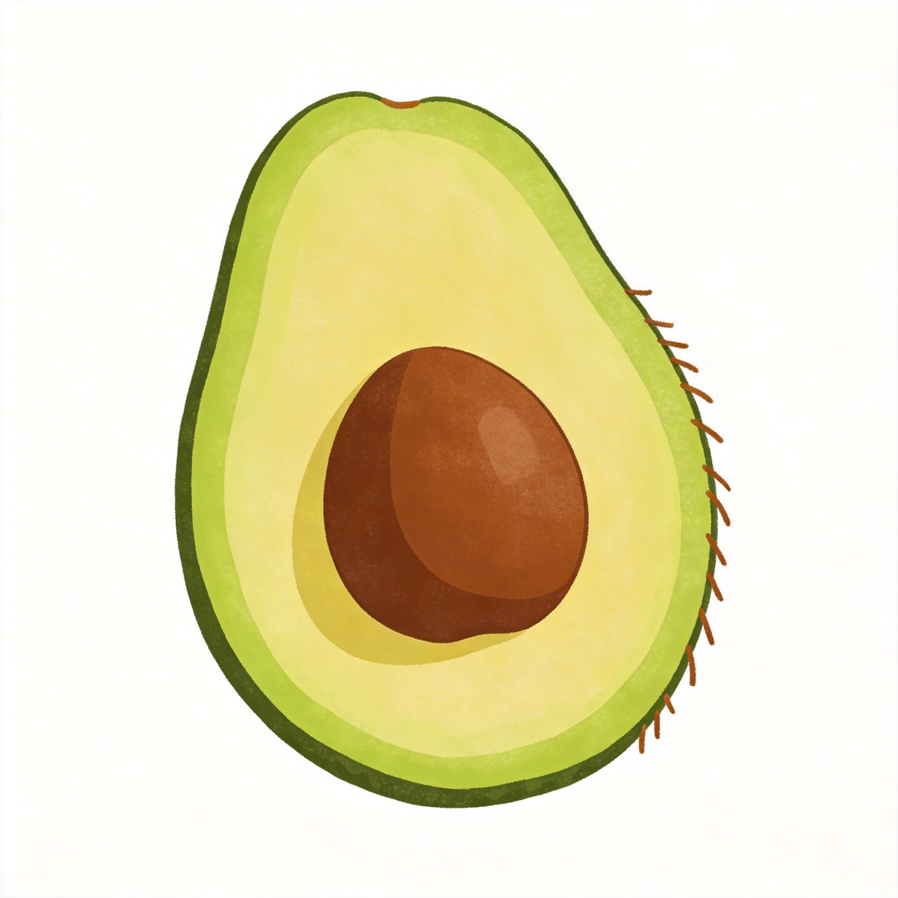
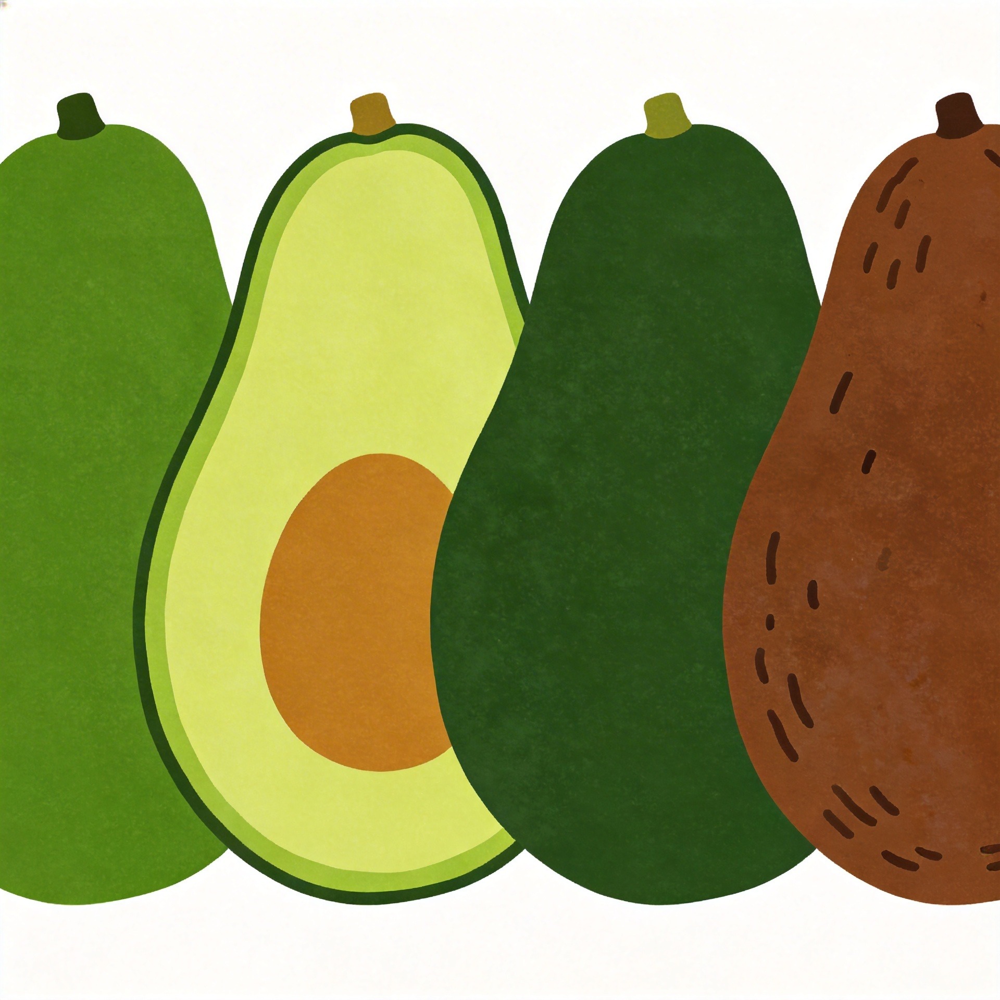
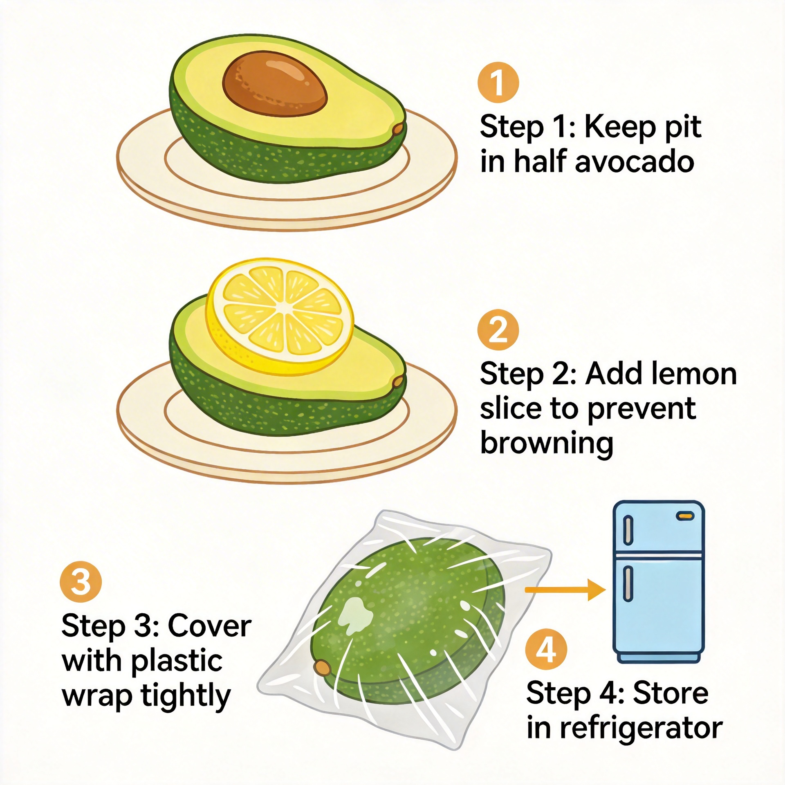

# 牛油果切开有黑丝还能吃吗？一篇讲清楚

前两天刷朋友圈，看到一个朋友晒图：切开的牛油果里全是黑色丝状物，配文"这还能吃吗，扔了心疼"。评论区吵成一团，有人说"没事，削掉就行"，也有人说"赶紧扔，会中毒"。

这场景我太熟悉了。今天就把牛油果黑丝这件事说清楚。

---

## 牛油果的黑丝到底是啥？

说实话，第一次在果肉里看到黑丝，我也纠结了很久。那种一条条褐色的纤维状物质，膈应人。

查完资料才知道，这东西主要是**单宁类物质氧化聚合形成的**。牛油果切开后果肉暴露在空气里，单宁和氧气来了场化学反应，然后就变褐变黑了。

还有一种情况是牛油果本身的**维管束组织**——就是果肉里运输水分和营养的"管道"，成熟过程中会变得明显，看着像一根根黑丝。

两种情况的区别：单宁氧化形成的黑丝分布比较均匀，维管束一般是顺着果肉纹理走的。

---

## 为什么会产生黑丝？3个原因

**原因一：熟过了。**

牛油果从生到熟有个最佳食用窗口期。过了这个点，果肉就开始出现黑丝。这跟苹果放久了变黄是一个道理——氧化。熟过头的牛油果不仅有黑丝，口感也变寡淡了，还可能带点发酵味。

**原因二：保存方式不对。**

切一半的牛油果直接扔冰箱，果肉表面会慢慢氧化变黑。正确做法是保留果核、喷点柠檬汁、裹保鲜膜。但即便这样，超过24小时也可能出现黑丝。

**原因三：品种和个体差异。**

不同品种的牛油果，抗氧化能力不一样。有的品种就是容易出黑丝。同样保存两天，有的没事，有的第二天就黑了。

---

## 有黑丝到底能不能吃？

这是大家最关心的。

我的经验是：**看情况**。

如果黑丝只是少量分布在表面，颜色偏浅褐，而且果肉没有异味、质地还算正常，**把有黑丝的部分削掉，剩下的能吃**。跟苹果削掉变黄的地方一个道理。

但出现以下情况，**建议直接扔**：

- 黑丝面积大，遍布大半个果肉
- 果肉有明显酸味或发酵味
- 质地发黏甚至流水
- 不仅有黑丝，还有黑色斑点或霉斑

最后一种要特别注意：发霉导致的黑色斑点不能吃。霉菌产生的毒素肉眼可看不见。

---

## 怎么挑到不容易有黑丝的牛油果？

既然知道了原理，挑选就有方向了。

**看颜色**：成熟的牛油果外皮是深绿或深褐色，有光泽说明新鲜。外皮发黑发皱的，说明放久了。

**摸硬度**：轻轻按压，有轻微软度但不是完全软塌，说明在最佳食用期。完全硬是生的，太软就是熟过了。

**看果柄**：果柄绿或浅褐说明新鲜。干枯发黑的话，成熟度可能过了。

**掂重量**：同样大小，更重的那一个水分更足更新鲜。

---

## 切开的牛油果怎么保存？

世纪难题。我的做法：

1. **保留果核**：果核能减缓氧化速度，切一半的一定要留核。

2. **喷柠檬汁**：维生素C是天然抗氧化剂，在果肉表面喷一点。

3. **密封**：保鲜膜裹紧，或者放密封盒。

4. **冷藏但别太久**：48小时是极限，就算不黑口感也变差了。

5. **冻成泥**：实在吃不完就把果肉挖出来冻成冰块，做奶昔加进去，不影响风味。

---

## 说在最后

牛油果是个好东西，但确实娇气。下次切开发现有黑丝，先用上面的方法判断一下：少量黑丝没异味的，削掉就能吃；大面积发黑或者有异味的，该扔就扔。

**健康比一个牛油果值钱。**

---

**你有过牛油果出黑丝的经历吗？最后怎么处理的？评论区聊聊。**
