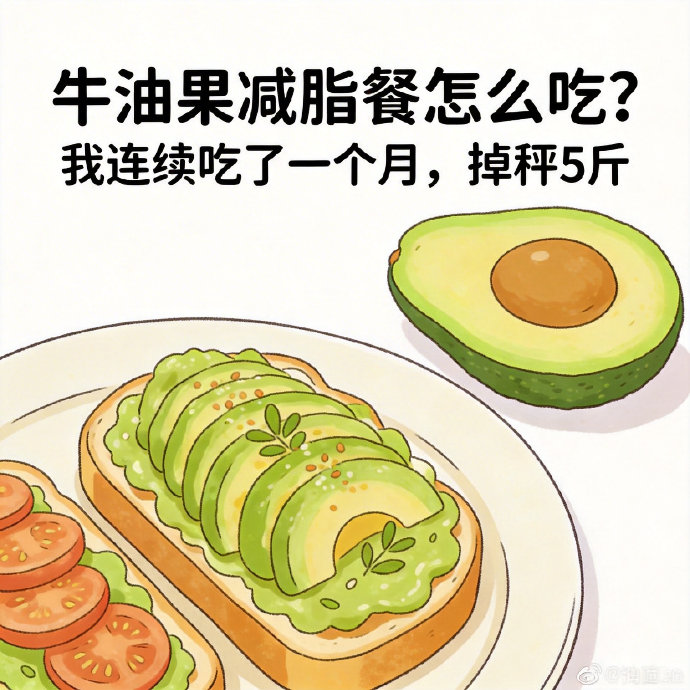
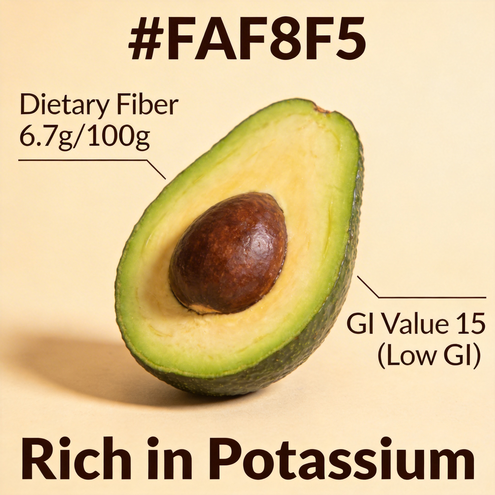
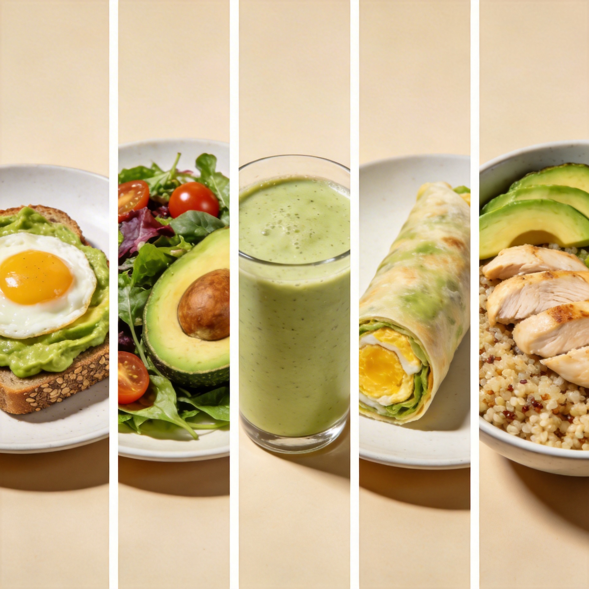
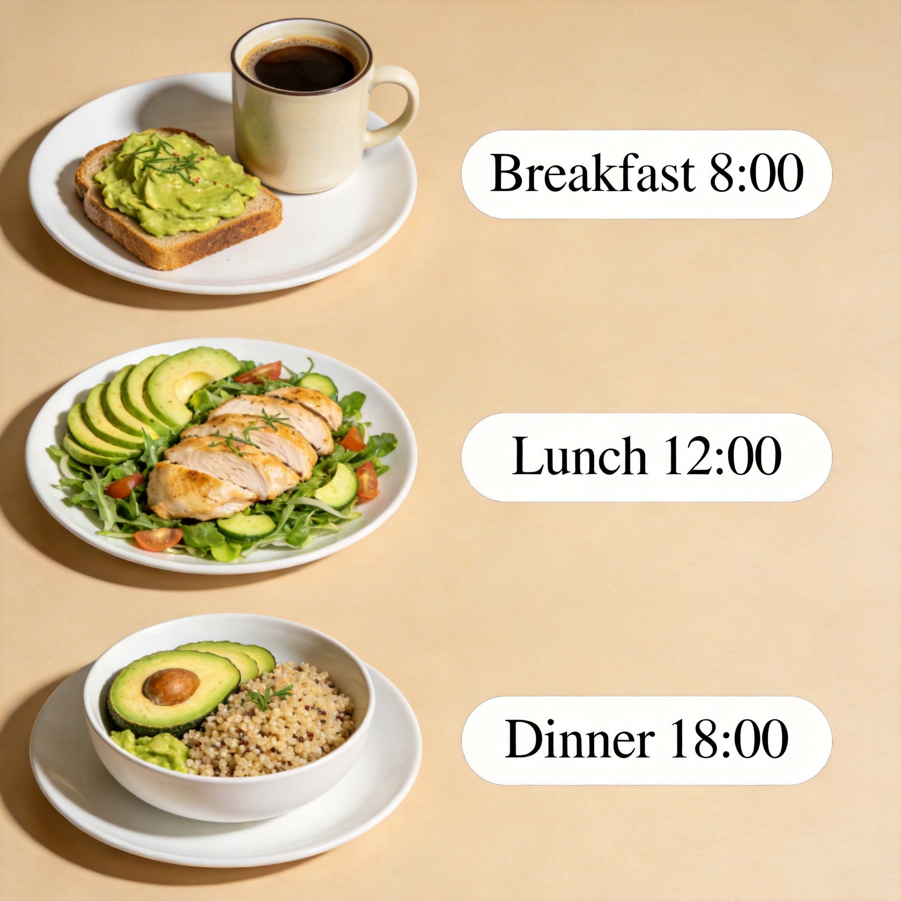

# 牛油果减脂餐怎么吃？我连续吃了一个月，掉秤5斤

上个月朋友看我早餐天天吃牛油果，问我："你疯了吗？牛油果热量那么高还减肥？"

我笑而不语。等我晒出体检报告，她傻眼了。

今天就把这个"秘密"说出来——牛油果，可能是你最不该错过的减肥食材。

---

## 牛油果为什么能减肥？

很多人一听说"脂肪"就害怕，觉得减肥必须远离所有油脂。

其实大错特错。

**牛油果里的脂肪，大部分是不饱和脂肪酸**。这种脂肪不仅不会让你发胖，还能提供超强的饱腹感。

我之前早上吃面包，十点就饿得头晕。但换成牛油果吐司，硬是撑到中午都不带饿的。

这不是玄学，有数据撑腰：

- 每100克牛油果含膳食纤维6.7克，相当于两根芹菜
- GI值只有15，属于低GI食物，吃完血糖不会坐过山车
- 富含钾元素，能帮助身体排出多余水分

简单说：牛油果抗饿、血糖稳、不水肿。这三个特性，天然就是为减肥而生的。

---

## 5种简单牛油果减脂餐

下面这5个食谱，是我亲测好吃又不长胖的搭配。每天换着吃，一周都不腻。

### 1. 牛油果吐司（5分钟）

- 牛油果半个，压成泥
- 撒少许盐和黑胡椒
- 铺在全麦吐司上
- 顶个水煮蛋

我每天早上都吃这个。碳水和优质脂肪都有了，蛋白质也补了，一举三得。

### 2. 牛油果沙拉（10分钟）

- 生菜、小番茄、黄瓜打底
- 牛油果半个切块
- 淋柠檬汁+橄榄油

午餐来一碗这个，比那些沙拉酱拌的轻食清爽一百倍。

### 3. 牛油果奶昔（3分钟）

- 牛油果半个
- 牛奶或豆奶200ml
- 香蕉半根（可选）

丢进搅拌机，打完直接喝。口感丝滑得像冰淇淋，热量却只有它的零头。

### 4. 牛油果鸡蛋卷（15分钟）

- 鸡蛋打散煎成蛋饼
- 牛油果泥抹在上面
- 卷起来切段

这个作为加餐特别合适，蛋白质和脂肪双补，饿的时候来一条准没错。

### 5. 牛油果藜麦碗（20分钟）

- 藜麦煮熟铺底
- 牛油果、鸡胸肉、烤蔬菜
- 撒点酱油和芝麻

晚餐吃这个，碳水控制在50克以内，蛋白质却有一大把，睡着了都在燃脂。

---

## 一天三餐怎么吃？

有人问我：所以到底怎么吃？

我的标准搭配是这样的：

**早餐**：牛油果吐司 + 咖啡

一个上午都精力满满，不会犯困也不会饿。

**午餐**：牛油果沙拉 + 鸡胸肉

轻负担下午工作效率都高。

**晚餐**：牛油果藜麦碗

控制在7点前吃完，睡前基本不饿。

---

## 说在最后

牛油果从来不是减肥的敌人，**不会吃才是**。

把沙拉酱换成牛油果，把零食换成牛油果奶昔，把白米饭换成藜麦牛油果碗——不用饿肚子，也能慢慢瘦。

我一个月掉了5斤，没有运动加成，纯靠吃对。

你也可以试试。

---

**你平时都用什么代替沙拉酱？评论区聊聊~**
