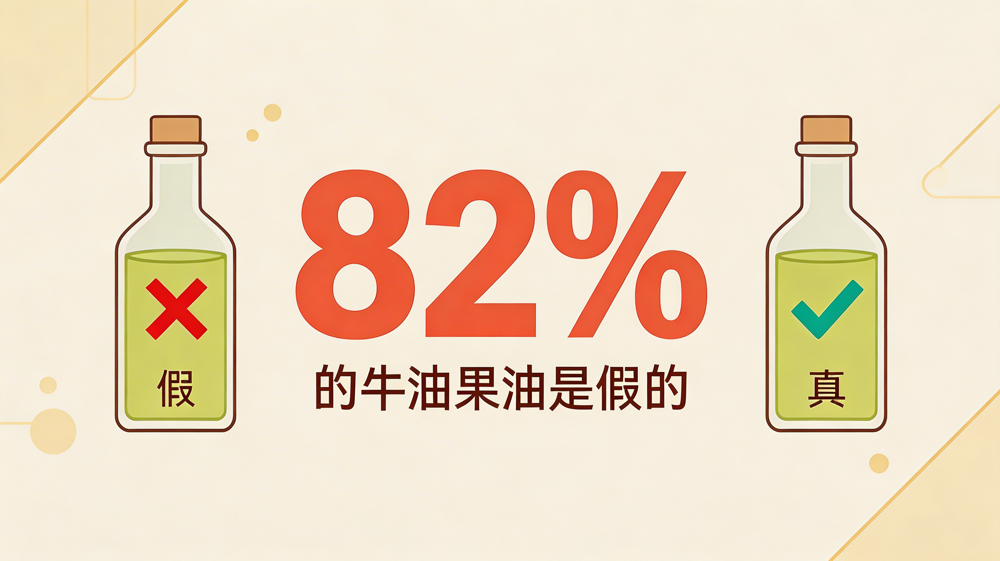
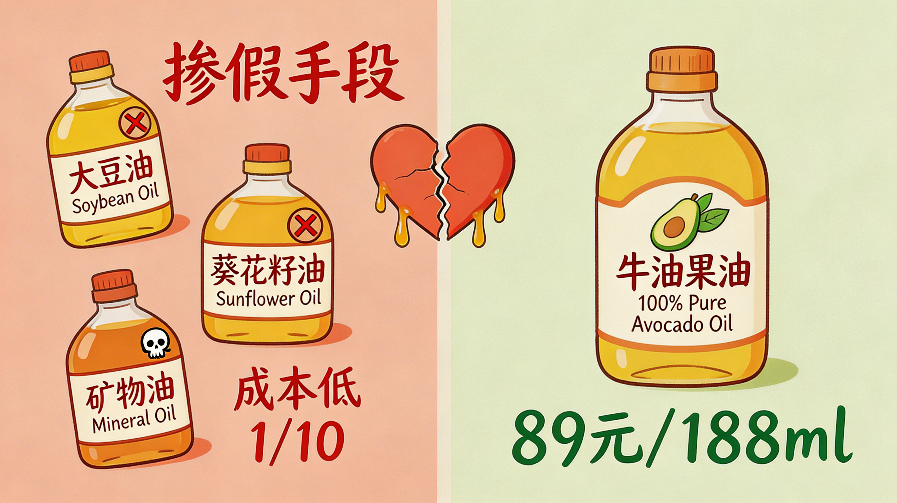
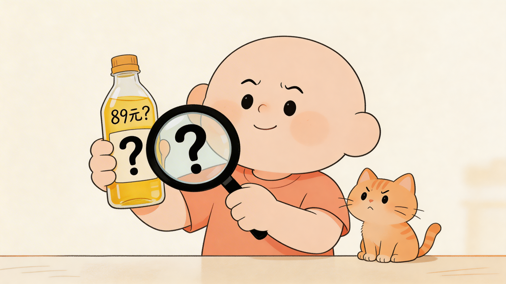
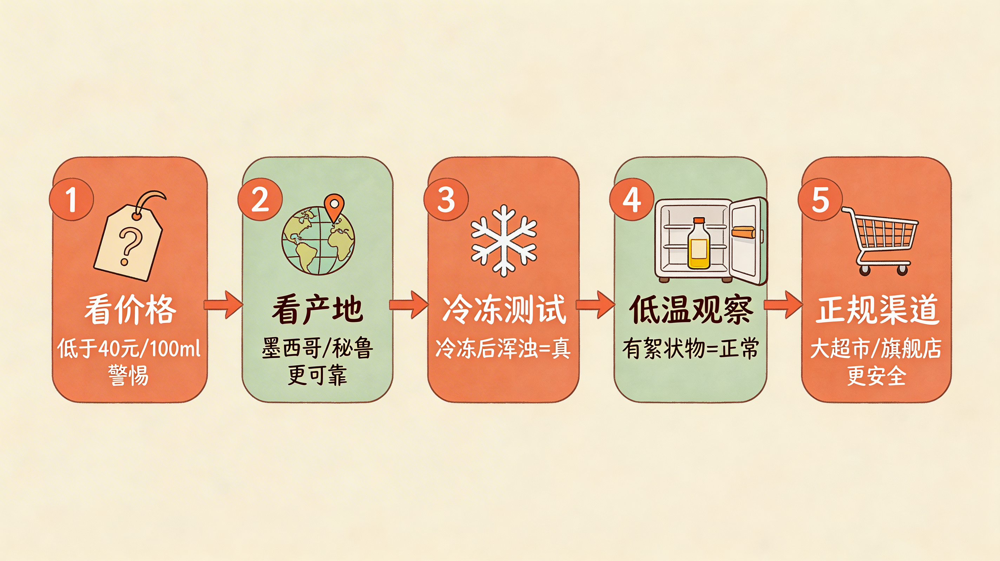
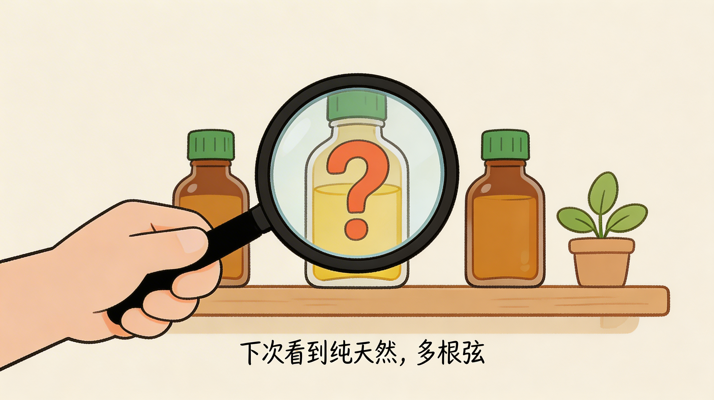

# 你买的那瓶牛油果油，可能82%都是假的

---

上个月逛超市，看到一瓶标注"100%纯牛油果油"的进口货，188ml，标价89块。

结账的时候我顺手拿了。

回家查了查资料，再看这瓶子，就没那么顺眼了——

**UC Davis 2020年抽检了市售牛油果油，82%存在掺假。**

掺的是什么？大豆油、葵花籽油、矿物油。换句话说，你买五瓶，大概只有一瓶是真正的牛油果油。

---

## 一、掺假手段

第一种是直接用廉价油调色。大豆油或者葵花籽油，加点调色剂，成本不到牛油果油的三分之一，外行根本看不出来。

第二种是在真油里掺廉价油。15%到50%不等，标签照写"100%纯"。

第三种是矿物油。这个最黑，摄入后在人体内代谢困难，长期积累有健康风险。

有一个细节值得注意：研究没有发现大品牌的掺假率比小品牌低。相反，有几个知名进口品牌同样检出了问题。

---

## 二、为什么假油这么多

说到底是利润。

冷榨牛油果油出油率低，原料成本高，正规渠道的终端售价很难低于60块/100ml。而一升大豆油的价格，大概是同等重量牛油果油原料的十分之一。

这个利润空间，足够让一些人动心思。

另外，牛油果油的颜色从淡绿到金黄都有，取决于果实成熟度和加工工艺。掺了廉价油之后，颜色差别肉眼几乎不可见。你买回家摇一摇闻一闻，也闻不出问题。

国内目前对牛油果油没有专门的国家标准，"纯天然""冷榨"这些标签基本靠企业自律。

---

## 三、假油有什么危害

买牛油果油的人，多数是冲着高油酸去的。油酸对心血管有益，是这瓶油卖得贵的核心原因。

掺了大豆油之后，油酸比例大幅下降，你吃进去的跟普通调和油差别不大。

如果掺的是矿物油，问题更严重。

还有一笔账：花着牛油果油的价格，吃进去是廉价油。算下来不如直接买瓶橄榄油。

---

## 四、怎么辨别

**价格是第一个信号**。进口正规渠道，100ml规格，低于40块的要打个问号。

**看产地**。墨西哥和秘鲁的相对稳定，种植历史长，标准也相对完善。

**冷冻测试可以试试**。把油放进冷冻室几小时，纯牛油果油会变浑浊或出现结晶，掺了廉价油的通常变化不大。这个方法不100%准，但能筛掉大部分假货。

**观察低温表现**。纯牛油果油在冰箱冷藏后可能出现絮状物，这是正常的——脂肪在低温下会析出。完全不变化的，反而可能是精炼过的，或者掺了稳定性强的廉价油。

**渠道尽量选正规**。大型商超的正规货架、天猫京东旗舰店相对来说更靠谱。朋友圈和代购渠道产品，出了问题追责难度大。

有条件的话，可以买第三方食品检测试纸自己测，或者送检。现在正规检测大概200-500块/次。

---

### 写在最后

我不是要制造焦虑。

只是想让你知道，花大钱买"健康"这件事，没那么简单。

下次看到"100%纯天然"这种标签，脑子里多一根弦就够了。

**你被假油坑过吗？评论区说说。**

---

> 数据来源：UC Davis 2020年市售牛油果油掺假检测研究，发表在《Food Control》期刊
