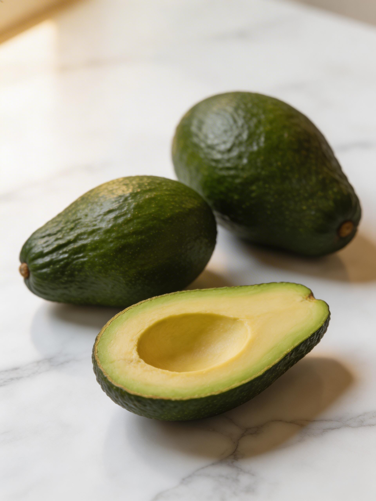
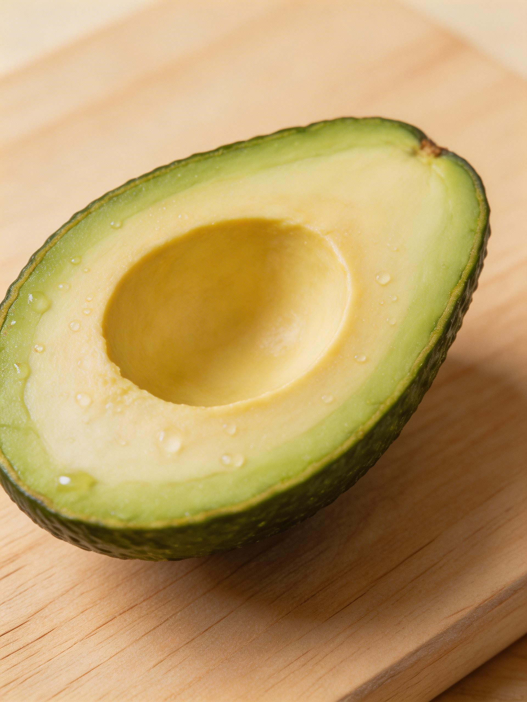
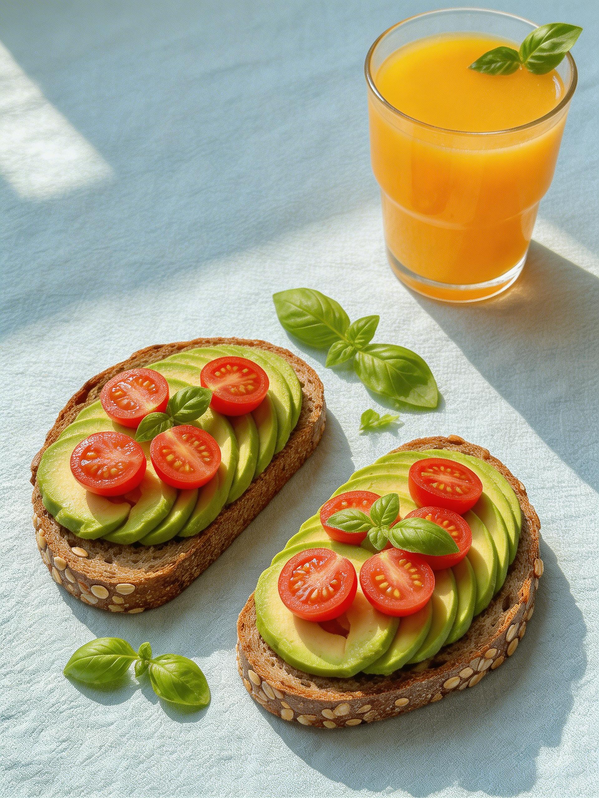
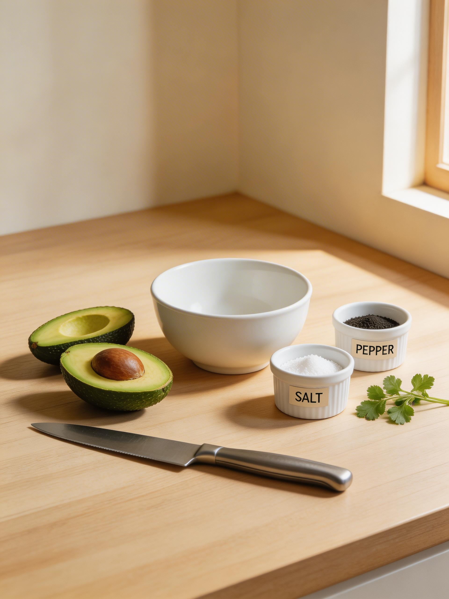
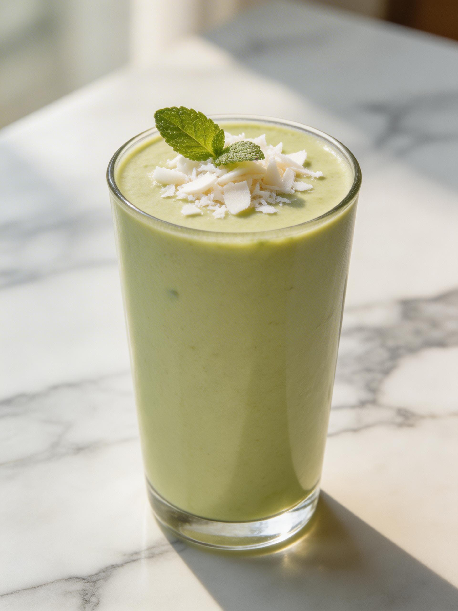

# 树熟牛油果，收到就能吃！终于不用等它烂了

---

## 📕 笔记信息

- 👥 **目标受众**：健身爱好者、宝妈、30-40岁女性
- 📌 **笔记类型**：种草安利
- 🔥 **核心卖点**：树熟牛油果，收到直接可以吃

---

## 📝 笔记正文

### 黄金3秒开头

姐妹们！！🥑

你们有没有过这种经历？
买回家的牛油果，硬得能砸核桃...
等它终于软了，一切开居然全黑了？？？
我以前每个月都要浪费2-3个，心疼money啊！

---

### 干货主体

直到我发现了【树熟牛油果】这个宝藏！
跟普通催熟果完全不是一回事👇

🌿 **什么是树熟？**
就是在树上自然成熟后才采摘
不经过乙烯催熟，保留完整营养

✅ **树熟的3大优势：**

1️⃣ **收到就能吃！** 不用等3-5天
2️⃣ **果肉更绵密丝滑**，口感超赞
3️⃣ **氧化黑斑？** 不存在的

📊 **营养数据：**
- 100g ≈ 160大卡（1个中等≈320大卡）
- 钾含量是香蕉的2倍
- 膳食纤维占每日需求27%
- 单不饱和脂肪，对心血管友好

---

## 🖼️ 配图展示

### 封面图

### 牛油果切面特写

### 牛油果吐司早餐

### 1分钟快手做法

### 牛油果奶昔

---

👩‍🍳 **3种快手吃法（附详细步骤）：**

---

### 【吃法1：1分钟抹吐司】

🥑 牛油果对半切 → 挖出果肉 → 压成泥 → 撒点海盐黑胡椒 → 搞定！

配全麦吐司，减脂期超满足～

---

### 【吃法2：牛油果鸡蛋沙拉】

🥑 牛油果切块 + 水煮蛋 + 小番茄 + 一点柠檬汁

搅拌均匀就是清爽沙拉

---

### 【吃法3：牛油果奶昔】

🥑 牛油果半颗 + 香蕉1根 + 牛奶/酸奶

打匀就是丝滑奶昔～

---

### 真实感构建

⚠️ **小提醒：**
- 一天最多吃半个哦，别贪多
- 建议搭配蛋白质（鸡蛋/三文鱼）一起吃
- 切开吃不完？抹点柠檬汁保存

---

## 🏷️ 热门标签

#树熟牛油果 #牛油果减脂餐 #健身餐 #健康饮食 #减脂食谱 #轻食 #超级食物 #减脂期吃什么 #早餐灵感 #一人食

---

## 🚀 黄金一小时运营策略

### 互动钩子

你们买牛油果最头疼的问题是什么？
是催熟太久？还是切开有黑斑？
评论区告诉我～

另外！选【树熟】还是【催熟】，你们会选哪个？
🙋 投个票吧：
A. 树熟！等不及想吃
B. 催熟也行，便宜

### 神评论预埋

示例1（求链接）：
"姐妹这个在哪里买的！求🔗"
"已收藏，坐等分享～"

示例2（真实反馈）：
"真的！我上次买的催熟果，切开全黑了，心态崩了"
"树熟的确实好吃很多，口感完全不一样"

### 转化话术

"宝子们，这是云南产区的树熟牛油果，季节限定～
想尝鲜的姐妹可以点我主页看看，笔记里挂了🔗"

---

## 📚 参考研究资料

- [[牛油果减脂餐_深度研究_2026-03-17]] - 深度研究报告
- [[牛油果减脂餐_prompts]] - 配图提示词

---

*本文档由 AI 小红书创作工作流自动生成*
*创作日期：2026-03-17*
