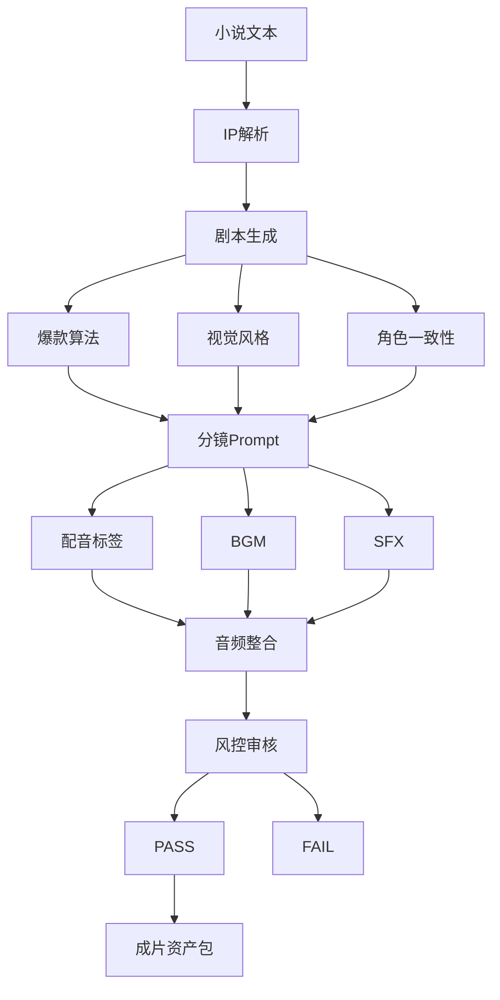

# P2-3: 工作流可视化方案

> 版本: 1.0.0
> 日期: 2026-03-25
> 状态: ✅ 设计完成
> 参照: ZJT workflow.js + LibTV Canvas + 漫舟13个Skill

---

## 一、工作流依赖图

---

## 二、节点类型定义

| 类型代码 | 对应Skill | 输入端口 | 输出端口 |
|----------|-----------|----------|----------|
| input_novel | - | 0 | 1 |
| process_ip_parser | manzhou-ip-parser | 1 | 1 |
| process_script | manzhou-script | 1 | 1 |
| process_hit | manzhou-hit-engine | 1 | 1 |
| process_visual | manzhou-visual-style | 1 | 1 |
| process_character | manzhou-character-consistency | 1 | 1 |
| process_storyboard | manzhou-storyboard | 2 | 1 |
| process_voice | manzhou-voice | 1 | 1 |
| process_bgm | manzhou-bgm | 1 | 1 |
| process_sfx | manzhou-sfx | 2 | 1 |
| process_audio | manzhou-audio | 3 | 1 |
| decision_safety | manzhou-safety | 1 | 2 |
| output_asset | - | 2 | 0 |

---

## 三、工作流模板

| 模板 | 包含节点数 | 适用场景 |
|------|-----------|---------|
| 完整流程 | 13个 | 全新小说 → 成片资产 |
| 快速模式 | 跳过IP解析 | 已有IP档案 |
| 仅分镜+音频 | 8个 | 已有剧本 |
| 音频补充 | 5个 | 已有分镜 |
| 风控复查 | 1个 | 仅风控审核 |

---

## 四、技术选型

| 方案 | 技术栈 | 推荐度 |
|------|--------|--------|
| React Flow | React + React Flow | ⭐⭐⭐ 对标LibTV |
| Vue Flow | Vue + Vue Flow | ⭐⭐ |
| Vanilla JS + SVG | 原生JS | ⭐ |

**推荐: React Flow**（与LibTV Canvas技术栈一致）

---

## 五、实现工作量

| 阶段 | 内容 | 工作量 |
|------|------|--------|
| P2-3.1 | 静态工作流图（JSON + Mermaid） | 0.5天 |
| P2-3.2 | React Flow可视化编辑器 | 3天 |
| P2-3.3 | 属性面板（参数配置） | 1天 |
| P2-3.4 | 执行引擎（状态机 + 产物写入） | 2天 |
| P2-3.5 | LibTV Canvas导出器 | 1天 |
| **合计** | | **7.5天** |
