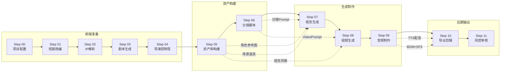

# AI漫剧制作 SOP · 12步总流程

> **适用**：AI漫剧/短剧从小说到成片的全流程制作
> **评级说明**：⭐ = A级验证通过 | 🔶 = B级逻辑可行 | ⚠️ = 待验证

---

## 流程总图



---

## Step 00 · 项目配置

**目的**：确定项目基本信息，为后续所有环节提供统一配置基线

**输入**：小说/IP名称 + 类型 + 目标平台 + 集数

**输出**：`项目配置单.md`（产出模板 → [[Step00-项目配置]]）

**评级**：⭐ A级

**核心检查项**：
- [ ] 短剧类型确定（都市/古风/甜宠/悬疑/复仇）
- [ ] 目标平台（抖音/快手/视频号）
- [ ] 单集时长（60秒/120秒/180秒）
- [ ] 风格预设选择（见 [[视觉风格预设索引]]）
- [ ] 成本预算确认

**引用Skill**：[[manzhou-global-settings]]

---

## Step 01 · 短剧改编

**目的**：将小说/网文转化为适合短剧格式的改编稿

**输入**：原始小说文本

**输出**：改编剧本（分集大纲 + 对白调整）

**评级**：⭐ A级

**核心原则**：
- 删除旁白内心独白，转化为可见动作/对话
- 每30秒一个小冲突，每60秒一个情绪转折
- 保留原著核心人设和经典台词

**引用Skill**：[[manzhou-novel-adapter]]

---

## Step 02 · IP解析

**目的**：从改编稿中提取角色、场景、道具世界观资产

**输入**：改编剧本

**输出**：`IP档案.yaml`（角色卡 + 场景卡 + 道具系统）

**评级**：⭐ A级

**核心资产**：
- 角色DNA（外貌/性格/行为模式）
- 场景基元（地点 + 时间 + 氛围）
- 道具标记系统

**引用Skill**：[[manzhou-ip-parser]]

---

## Step 03 · 剧本生成

**目的**：生成符合AI视频生成要求的标准化剧本

**输入**：改编稿 + IP档案

**输出**：`XX集-剧本.md`（三维一体：剧本 + 导演意图 + 音频标注）

**评级**：⭐ A级

**核心结构**：
```
# 第N集 标题
## 基础信息（集数/时长/情绪基调）
## 场景列表
## 分场剧本（每场含：场景/角色/对白/动作/情绪）
## 音频标注（BGM/SFX/TTS）
```

**引用Skill**：[[manzhou-script]]

---

## Step 04 · 导演控制塔 ⭐ 新增

**目的**：在剧本和分镜之间建立导演分析层，确保运镜意图传递

**输入**：标准化剧本

**输出**：`导演控制塔.md`（每场含：节拍/情绪/运镜/轴线/景别）

**评级**：⭐ A级

**核心约束**：
- 禁止跳过此步骤
- 每场必须有节拍定位（SRL：压力/释放/真空）
- 运镜方式必须具体（推/拉/摇/移/跟/固定）
- 轴线规则：180度轴线 + 防止跳轴

**引用Skill**：[[manzhou-director-control]]

---

## Step 05 · 资产库构建

**目的**：构建角色三视图、场景图、道具参考图

**输入**：IP档案

**输出**：
- `角色DNA手册.md`（角色三视图 + 九宫格定妆表）
- `场景库/`（场景参考图 + 氛围标注）
- `道具库/`（道具参考图 + 规格说明）

**评级**：⭐ A级

**角色DNA三层锁**：
1. **外貌锁**：面部特征 + 体型 + 肤色 + 年龄
2. **风格锁**：服装 + 化妆 + 道具
3. **行为锁**：表情习惯 + 肢体语言 + 动态特征

**引用Skill**：[[manzhou-character-design]] · [[manzhou-scene-design]] · [[manzhou-item-design]]

---

## Step 06 · 分镜脚本

**目的**：生成可直接用于AI视频生成的完整分镜脚本

**输入**：导演控制塔 + 资产库

**输出**：`XX集-分镜.md`（每镜含：时长/景别/运镜/image_prompt/video_prompt/音频标注）

**评级**：⭐ A级

**核心结构**：
```
## 镜头 N
- 时长：Xs
- 景别：特写/近景/中景/全景
- 运镜：推/拉/摇/移/固定
- 轴线：主轴方位
- 情绪：情绪标签
- 节拍：SRL定位
- image_prompt：AI生图Prompt
- video_prompt：AI视频Prompt（含Audio Layer）
- 角色ID：char_01, char_02
- 场景ID：loc_01
```

**引用Skill**：[[manzhou-shot-script]]

---

## Step 07 · 视觉生成

**目的**：使用AI生图工具生成每镜的角色+场景参考图

**输入**：分镜脚本中的 image_prompt

**输出**：角色参考图 + 场景图 + 道具图（上传OSS）

**评级**：⭐ A级（工具用法见 [[Seedance手册]] · [[Kling手册]]）

**工具选择**：
| 工具 | 适用场景 | 评级 |
|------|---------|------|
| Seedance | 角色一致性要求高 | A |
| Kling | 动态场景+运镜 | A |
| 即梦 | 快速测试 | B |

**关键约束**：角色图必须引用角色DNA手册中的外貌描述词

---

## Step 08 · 视频生成

**目的**：使用AI视频生成工具制作每镜视频片段

**输入**：分镜脚本中的 video_prompt + 参考图

**输出**：视频片段（MP4）

**评级**：⭐ A级（工具用法见 [[Seedance手册]] · [[Kling手册]]）

**核心参数**：
- 时长：3-5秒/镜
- 运镜方式必须与分镜一致
- 视频Prompt需注入 `[Audio Layer]` 标注

**工具选择**：
| 工具 | 适用场景 | 评级 |
|------|---------|------|
| Seedance 2.0 | 角色一致+运镜控制 | A |
| Kling 1.5 | 真实场景+动态 | A |
| 即梦 | 快速迭代测试 | B |

---

## Step 09 · 音频制作

**目的**：生成TTS配音 + BGM + SFX音效

**输入**：分镜脚本中的音频标注

**输出**：
- TTS配音文件（Lip-sync格式）
- BGM文件（情绪曲线标注版）
- SFX音效文件

**评级**：⭐ A级

**三轨时间轴规范**：
```
TTS轨：voice:(情绪/语速)"对白台词"
BGM轨：[BGM: 情绪描述]
SFX轨：[SFX: 音效类型]
```

**引用Skill**：[[manzhou-tts-voice]]

---

## Step 10 · 导出剪辑

**目的**：将所有视频片段 + 音频整合为完整短剧

**输入**：视频片段 + TTS + BGM + SFX

**输出**：完整短剧MP4 + 剪映工程文件

**评级**：⭐ A级

**引用Skill**：[[manzhou-export]]

---

## Step 11 · 风控审核

**目的**：在发布前完成合规检查

**输入**：成片 + 剧本

**输出**：`风控报告.md`

**评级**：⭐ A级

**检查维度**：
- 版权（原著/IP授权）
- 内容合规（违禁词/敏感内容）
- 肖像权（角色是否涉及真实人物）
- 平台规范（抖音/快手审核标准）

**引用Skill**：[[manzhou-safety]]

---

## 快速跳转

[[Step00-项目配置]] · [[Step01-短剧改编]] · [[Step02-IP解析]] · [[Step03-剧本生成]] · [[Step04-导演控制塔]] · [[Step05-资产库构建]] · [[Step06-分镜脚本]] · [[Step07-视觉生成]] · [[Step08-视频生成]] · [[Step09-音频制作]] · [[Step10-导出剪辑]] · [[Step11-风控审核]]

---

> [!example] 使用示例
> 拿到一部新小说 → 从 [[Step00-项目配置]] 开始 → 按顺序执行到 [[Step11-风控审核]] → 完成一部短剧的完整制作
