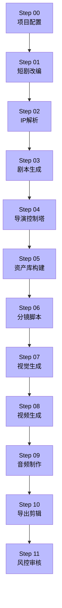

# AI漫剧制作知识库

> **定位**：可执行、可评级、可更新的短剧制作知识库
> **目标**：看完就能出结果，不需要二次加工
> **维护**：随项目执行持续迭代

---

## 快速导航

| 板块 | 用途 | 入口 |
|------|------|------|
| 🔄 [[SOP总流程]] | 全流程12步，附可点击跳转 | → Step 00-11 |
| 🧠 [[Prompt工程库]] | 验证过的Prompt模板，A/B级分类 | → 模板直接复制使用 |
| 🛠️ [[工具手册]] | Seedance/Kling/LibTV使用指南 | → 按工具查用法 |
| 📂 [[项目案例库]] | 格子间女人/竞品分析/对标提示词 | → 看真实案例怎么跑 |
| 📊 [[效果追踪]] | 镜头评分/Prompt进化/成本分析 | → 持续优化 |
| 🗂️ [[资源索引]] | 角色DNA/视觉风格/音频标签 | → 快速引用 |
| ⚙️ [[执行层]] | LibTV管道/ZJT多Agent/代码封装 | → **机器可执行的代码层** |

---

## 评级说明

本知识库所有内容按可执行度分级：

| 等级 | 含义 | 标准 |
|------|------|------|
| **A** | 多次验证，直接可用 | 已在真实项目中跑通，有评分数据，Prompt完整可复制 |
| **B** | 逻辑完整，首次验证 | 经过完整推演，有Prompt模板，但未在真实项目中跑过 |
| **C** | 框架可行，待填充 | 有结构和方向，但缺少关键参数或Prompt模板 |
| **D** | 参考价值 | 仅供学习，无直接使用价值 |

> [!tip] 优先使用A级内容
> 所有A级内容均已通过真实项目验证，可直接复制到新项目中使用。

---

## SOP总流程（12步）

---

## 最新验证状态

> [!abstract] 2026-03-26 更新
> - [[格子间女人]] 第01集：Step 00-10 已完成，Step 11 待验证
> - 漫舟 v6.0.0 主控Skill已整合
> - Prompt进化引擎已建立
> - **执行层整合完成**：LibTV管道 + ZJT多Agent架构 → 知识库现在有「方法论层」+「执行层」

---

## 关联Skill文件

以下漫舟Skill是本知识库的执行依据：

| Skill文件 | 职责 | 评级 |
|---------|------|------|
| [[manzhou-master]] | 主控Agent，总调度 | A |
| [[manzhou-director-v2]] | 导演版，LibTV执行层 | A |
| [[manzhou-director-control]] | 导演控制塔（Step 04） | A |
| [[manzhou-shot-script]] | 分镜脚本（Step 06） | A |
| [[manzhou-character-design]] | 角色设计（Step 05） | A |
| [[manzhou-scene-design]] | 场景设计（Step 05） | A |
| [[manzhou-visual-style]] | 视觉风格预设 | A |
| [[manzhou-image-prompt]] | 生图Prompt | B |
| [[manzhou-tts-voice]] | TTS配音 | A |
| [[manzhou-script]] | 剧本生成 | A |
| [[manzhou-safety]] | 风控审核 | A |
| [[manzhou-hit-engine]] | 爆款算法 | A |
| [[manzhou-novel-adapter]] | 短剧改编 | A |
| [[manzhou-ip-parser]] | IP解析 | A |
