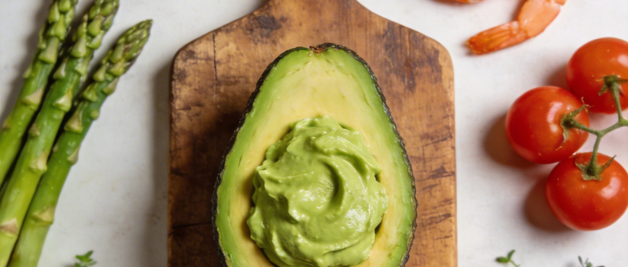
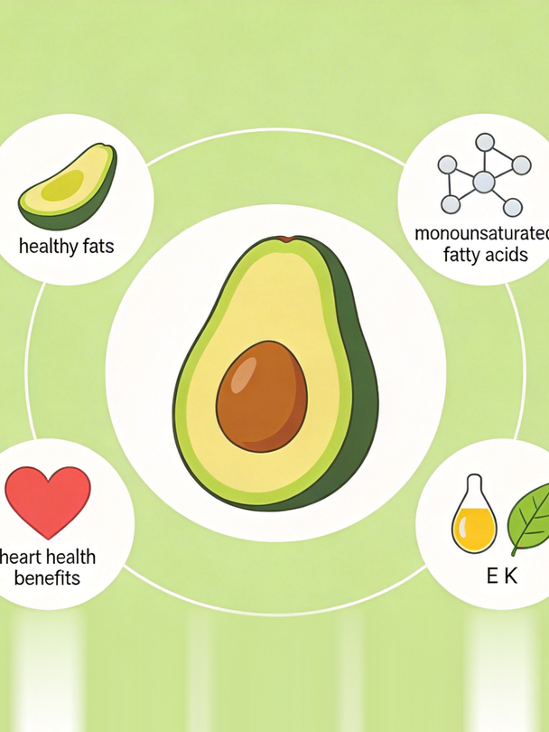
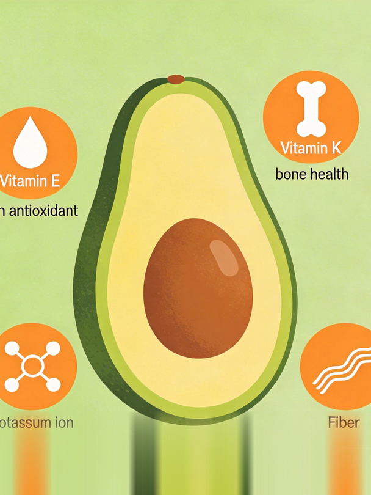
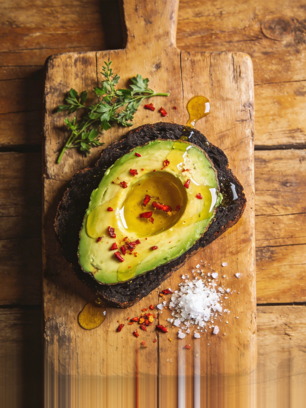
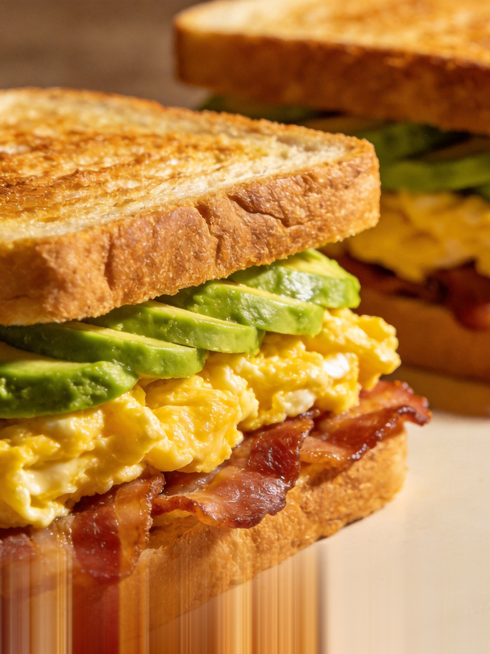
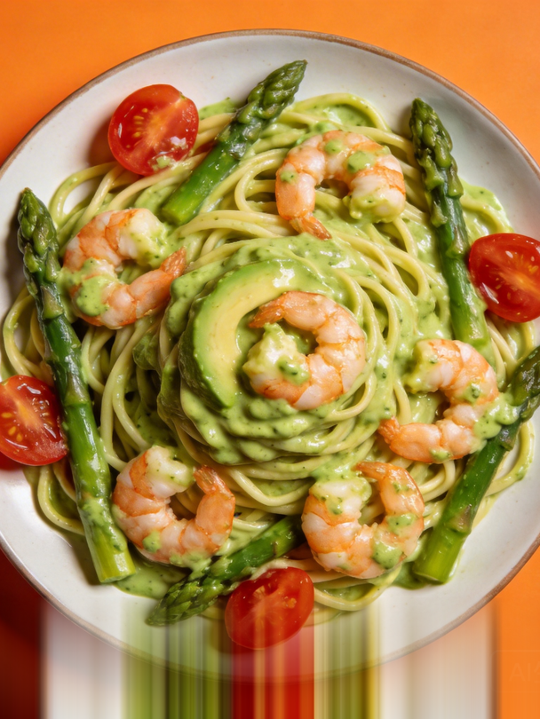
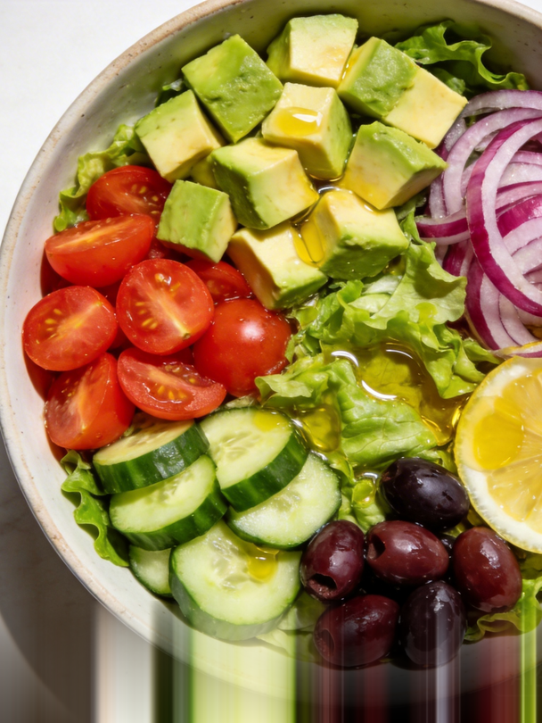

# 牛油果的6种神仙吃法，让你爱上这种"脂肪炸弹"

嗨，大家好！今天我要跟你们聊聊牛油果，这个被很多人称为"脂肪炸弹"的神奇水果。说实话，我第一次听说牛油果的时候，心里也是有点小抗拒的。毕竟，这个名字听起来就让人觉得有点油腻，对吧？但后来我发现，牛油果其实是个宝藏食物，不仅营养丰富，还能做出很多美味的创意料理，下面，我就来跟大家分享一下牛油果的6种神仙吃法，保证让你爱上它！

## 为什么牛油果被称为"脂肪炸弹"？

讲真，牛油果之所以被称为"脂肪炸弹"，主要是因为它含有丰富的单不饱和脂肪酸。不过，别一听"脂肪"就害怕，这种脂肪其实是对你身体有好处的那种。

### 牛油果中的单不饱和脂肪酸

我跟你说，单不饱和脂肪酸对心脏健康特别有帮助。它可以降低坏胆固醇（LDL），提高好胆固醇（HDL），从而减少心血管疾病的风险。而且，这种脂肪还能帮助你保持饱腹感，对于控制体重也很有帮助。

### 维生素E和K的丰富来源

牛油果还富含维生素E和K，这两种维生素对皮肤和骨骼健康都有很好的作用。维生素E是一种强大的抗氧化剂，可以帮助抵抗自由基，保护皮肤免受损伤。而维生素K则有助于骨骼健康，预防骨质疏松。

## 6种创意吃法，让你爱上牛油果

好了，说了这么多，咱们来看看牛油果的6种神仙吃法吧！

### 1. 牛油果吐司（早餐）

这可是我的最爱之一！早上切一片新鲜的牛油果，抹在烤得香脆的吐司上，再撒点盐和黑胡椒，简单又美味。有时候我会加个煎蛋，这样蛋白质和脂肪都有了，一顿完美的早餐就搞定啦！

### 2. 滑蛋三明治（早餐）

滑蛋三明治也是个不错的选择。把牛油果切片，夹在煎好的鸡蛋和面包之间，再加上几片培根或者火腿，简直是早餐界的王者。而且，这样的搭配不仅能提供能量，还能让你一上午都精神满满。

### 3. 虾仁芦笋意面（晚餐）

到了晚上，可以试试用牛油果做一道虾仁芦笋意面。先把虾仁和芦笋炒熟，然后加入切好的牛油果，拌在意面上。这道菜不仅颜色鲜艳，口感也特别丰富，既有海鲜的鲜美，又有牛油果的浓郁。

### 4. 牛油果沙拉（健康清爽）

夏天的时候，我喜欢做一份牛油果沙拉。把牛油果、番茄、黄瓜、生菜等蔬菜切好，加上一些橄榄油和柠檬汁，拌匀就可以吃了。这道沙拉不仅清爽可口，还能补充多种维生素和矿物质，非常适合减肥期间食用。

### 5. 牛油果冰淇淋（夏日清凉）

如果你喜欢甜品，不妨试试牛油果冰淇淋。把牛油果和牛奶一起打成泥，然后放进冰箱冷冻几个小时，就成了美味的冰淇淋。这种冰淇淋不仅口感细腻，还有牛油果独特的香味，绝对是夏日里的小确幸。

### 6. 牛油果奶昔（快速能量）

第六款，重磅推荐牛油果奶昔。把牛油果，香蕉、牛奶和蜂蜜一起放入搅拌机中，打成奶昔。这款奶昔不仅味道好，还能迅速补充能量，适合运动后饮用。

## 如何正确食用牛油果

话说回来，虽然牛油果好吃又有营养，但也不能贪多哦。一般来说，每天摄入半个到一个牛油果（约50-100克）就足够了。

### 每日摄入量（半个~1个）

我建议大家每天吃半个到一个牛油果，这样既能享受到它的营养价值，又不会摄入过多的热量。当然，如果你是健身爱好者或者需要大量能量的人，可以适当增加摄入量。

### 选购与保存技巧

买牛油果的时候，要注意选择表皮光滑、手感略软的。如果买回来的是硬的，可以放在室温下几天让它自然成熟。成熟的牛油果可以放进冰箱冷藏，这样能延长保鲜时间。

## 结语：牛油果，不只是食物

说真的，牛油果不仅是一种食物，更是一种烹饪媒介。它让创意无限延伸。无论是简单的吐司还是复杂的料理，牛油果都能带来不一样的风味。希望今天的分享能让你们爱上这个"脂肪炸弹"，并尝试更多美味的牛油果料理。下次见啦！
