# BigBanana AI Director（AI 漫剧工场）

> AI 一站式短剧/漫剧生成平台
> *Industrial AI Motion Comic & Video Workbench*

**BigBanana AI Director** 是一个 **AI 一站式短剧/漫剧平台**，面向创作者实现从灵感到成片的高效生产。

它抛弃了传统的"抽卡式"生成，采用 **"Script-to-Asset-to-Keyframe"** 的工业化工作流。通过深度集成 AntSK API 的先进 AI 模型，实现 **"一句话生成完整短剧，从剧本到成片全自动化"**，同时精准控制角色一致性、场景连续性与镜头运动。

## 界面展示

### 项目管理
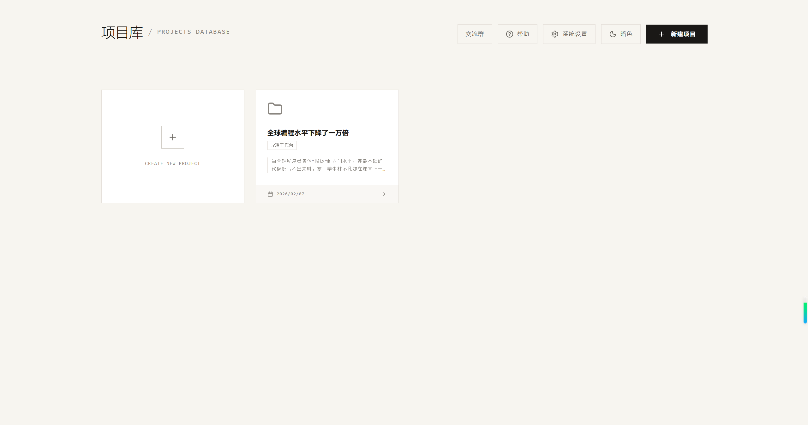

### 项目概览与小说导入
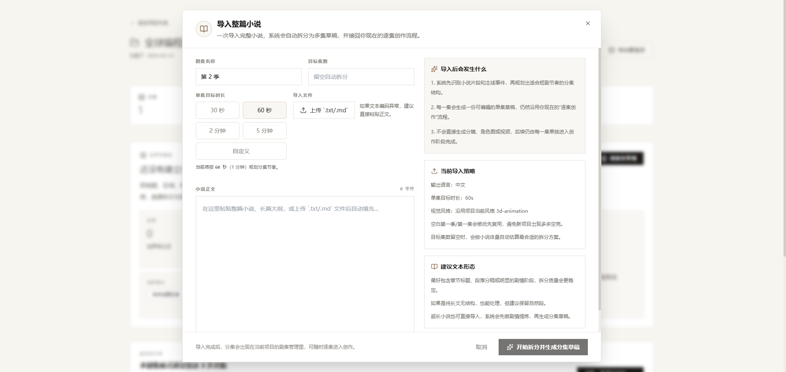

### 世界观构建
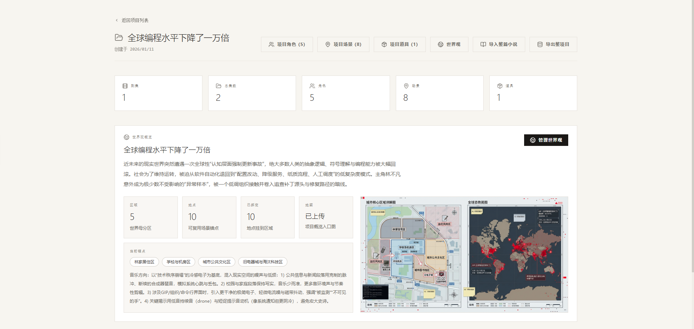

### Phase 01: 叙事规划
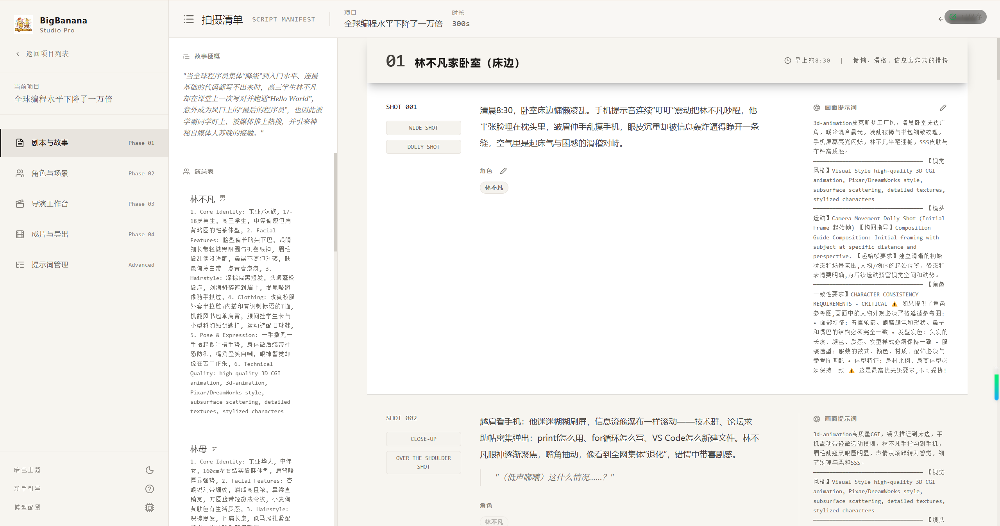
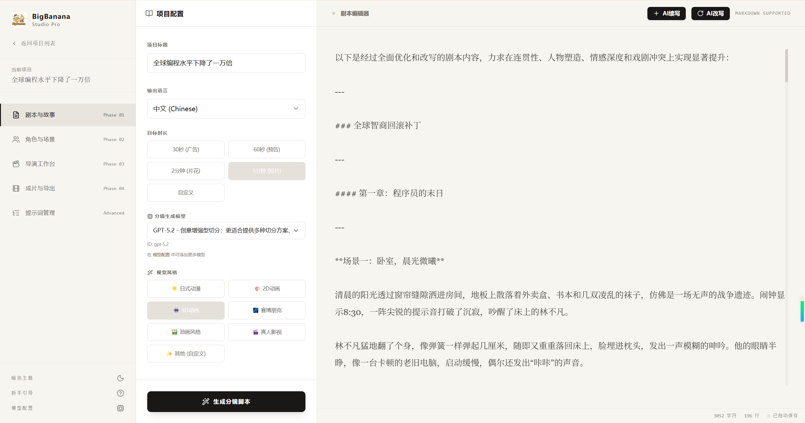

### Phase 02: 一致性资产
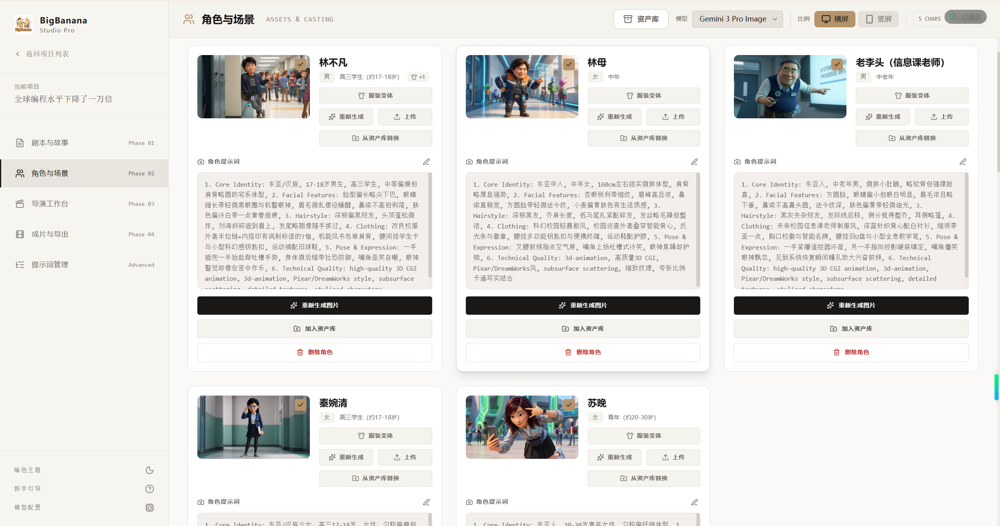
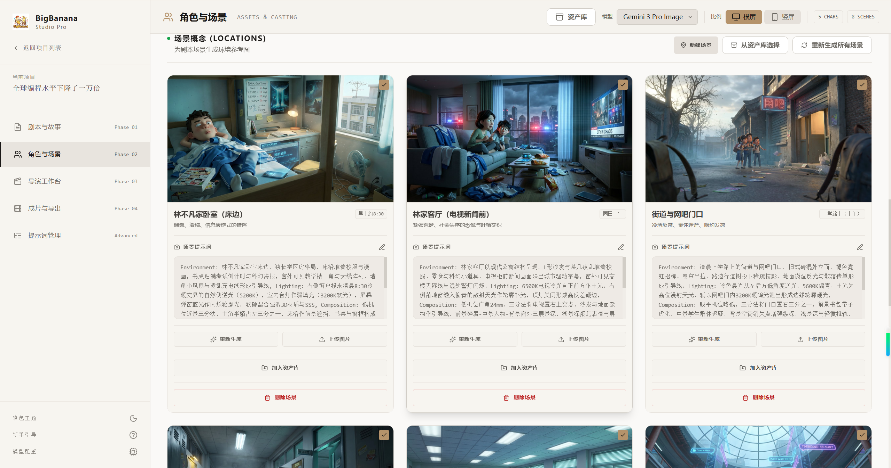
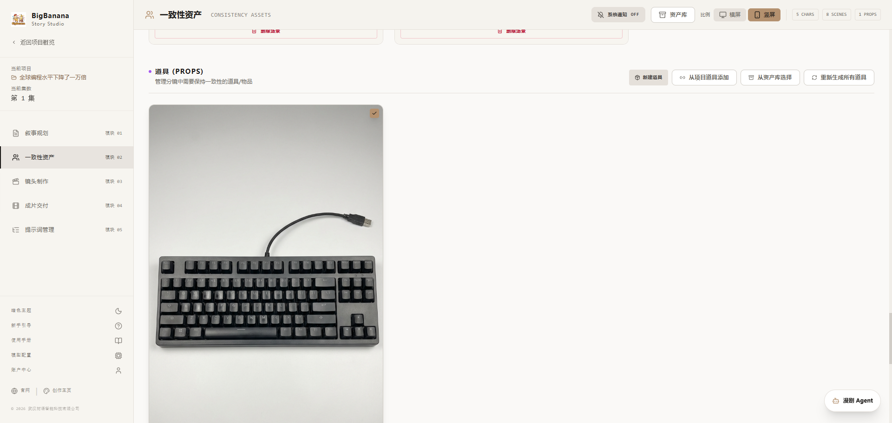

### Phase 03: 镜头制作
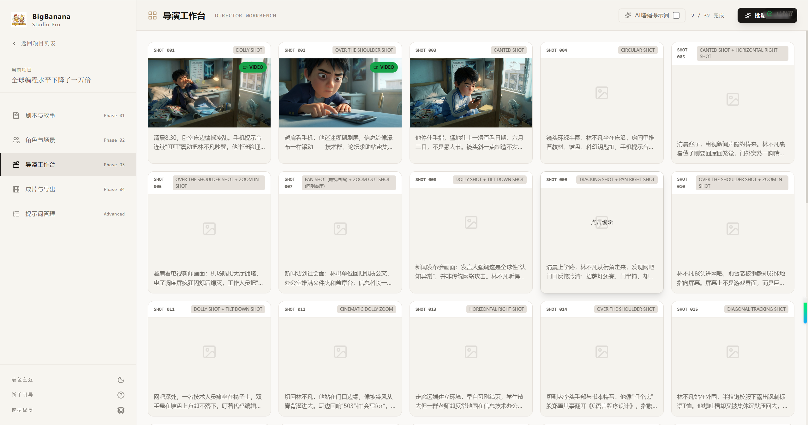
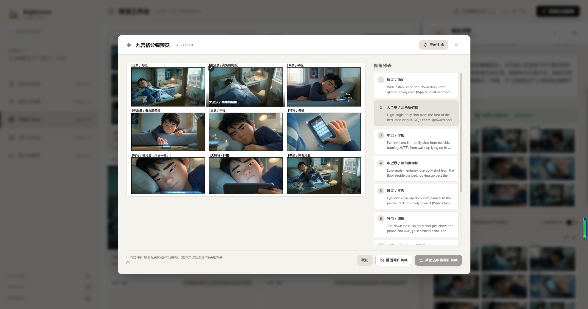
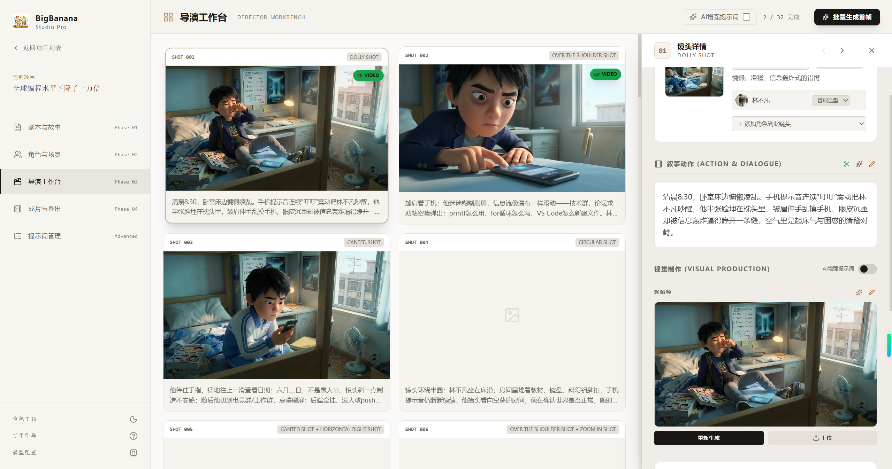
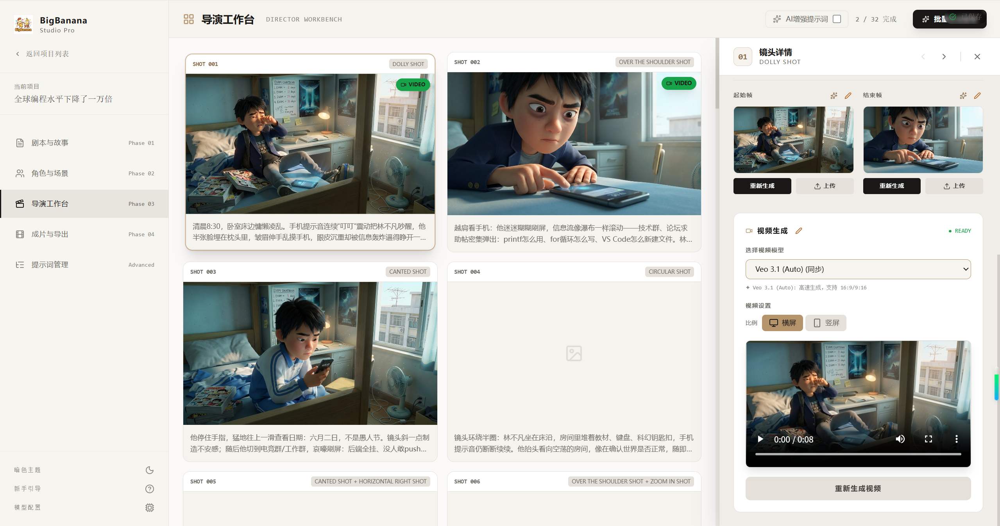

### Phase 04: 成片交付
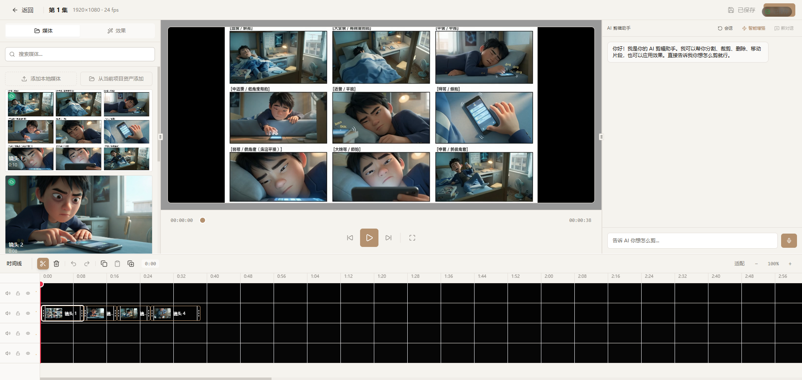
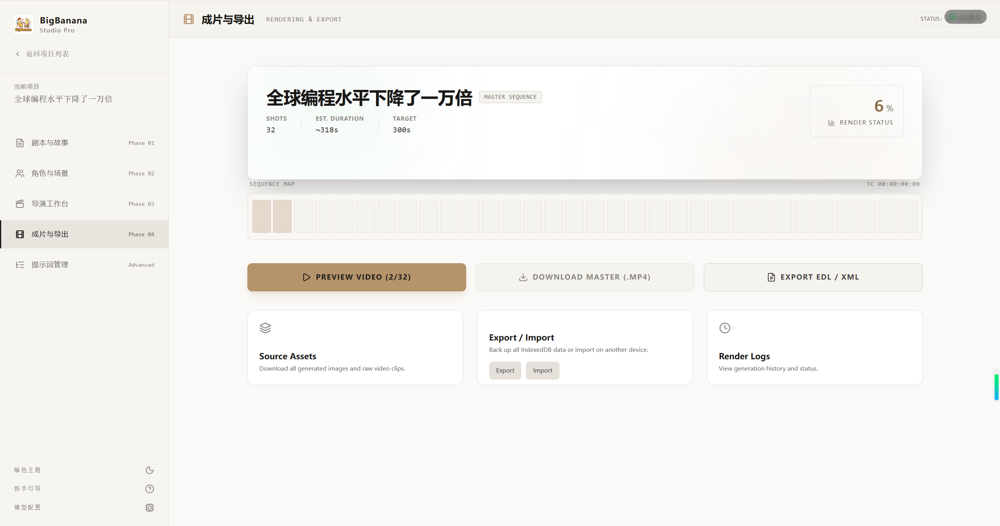

### 提示词管理
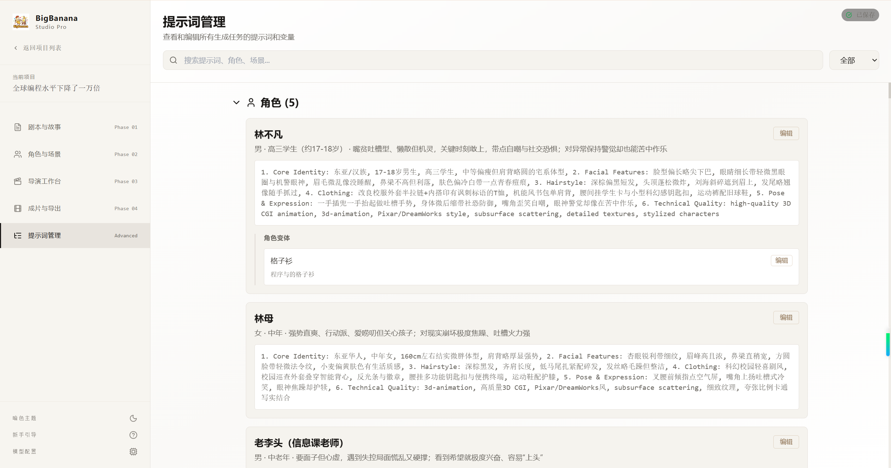

## 核心理念：关键帧驱动 (Keyframe-Driven)

传统的 Text-to-Video 往往难以控制具体的运镜和起止画面。BigBanana 引入了动画制作中的 **关键帧 (Keyframe)** 概念：

1. **先画后动**：先生成精准的起始帧 (Start) 和结束帧 (End)
2. **插值生成**：利用 Veo 模型在两帧之间生成平滑的视频过渡
3. **资产约束**：所有画面生成均受到"角色定妆照"和"场景概念图"的强约束，杜绝人物变形

## 核心功能模块

### 项目级工作流 (Project Workspace)

- **项目中心 (Project Hub)**：集中管理最近项目、账号入口、模型配置、全局资产库，以及整库数据导入导出
- **项目概览 (Project Overview)**：按"项目 → 季 → 集"组织内容，支持整篇小说导入并自动拆分多集草稿
- **项目资源与世界观**：在单集制作前先沉淀角色/场景/道具资源，以及地图、区域、地点、音乐风格等世界观锚点

### Phase 01: 叙事规划

- 结构化剧本生成：输入故事大纲或小说片段，AI 自动拆解角色、场景、道具、镜头
- 配置驱动生成：可设置语言、目标时长、视觉风格和模型组合
- AI 续写与手动精修：支持对剧本正文、角色视觉描述、镜头动作、台词和提示词进行续写、改写与手动编辑
- 全自动计划预审：系统先给出全自动生产方案，允许逐镜头决定使用"九宫格分镜"还是"首尾帧"链路

### Phase 02: 一致性资产 (Consistency Assets)

- **角色一致性定妆**：为每个角色生成标准参考图，并通过衣橱系统维护多套造型
- **场景/道具资产化**：为可复用道具建立独立提示词、参考图和形体参考
- **资产库复用**：支持跨项目资产库选择角色、场景、道具
- **批量补齐缺失资产**：可一键补齐角色、场景、道具的缺失图片

### Phase 03: 镜头制作 (Shot Workbench)

- **网格化镜头工作台**：全景式管理所有镜头，逐镜头查看叙事动作、角色、场景和道具上下文
- **关键帧精控**：支持 Start Frame / End Frame 生成、上传、继承与编辑
- **九宫格分镜预览**：可先生成 9 个候选视角，再选择整图或裁切单格作为首帧
- **上下文感知生成**：镜头生成时自动读取当前场景图、角色服装参考和道具参考
- **双视频链路**：既支持单图 Image-to-Video，也支持首尾帧插值生成

### Phase 04: 成片交付 (Delivery Center)

- **时间线预览与渲染追踪**：实时查看镜头完成度、粗剪时间线和渲染日志
- **CutOS 风格 AI 粗剪**：内置时间线编辑器，可对已生成镜头做调序、裁剪、滤镜和导出前检查
- **多种交付方式**：支持导出母版视频、片段压缩包和源素材
- **剧集级备份**：支持当前剧集数据导入导出

### Phase 05: 提示词管理 (Prompt Management)

- 集中检索与编辑：统一查看模板、角色、场景、道具、关键帧和视频提示词
- 版本回滚：保留提示词编辑历史
- 跨阶段排查：可直接回到这一页定位并修正上游提示词问题

## 为什么选择 AntSK API？

### 全模型覆盖

- **文本模型**: GPT-5.2、GPT-5.1、Claude 3.5 Sonnet
- **视觉模型**: Gemini 3 Pro、Nano Banana Pro
- **视频模型**: Sora-2、Veo-3.1 (支持关键帧插值)
- **一站式调用**：统一 API 接口，无需多平台切换

### 超值定价

- **官方 2 折以下**：所有模型价格均低于官方渠道 80%
- **按需计费**：无最低消费，用多少付多少
- **企业级稳定性**：99.9% SLA 保障

## ⚠️ 重要说明

> **后续更新方式**：由于多次出现抄袭、不署名转载，后续功能更新将只通过官方 Docker 镜像提供，不再同步公开源码。
>
> **当前仓库定位**：公开仓库保留为说明文档与历史参考版本，部署与升级请直接使用 `docker-compose.yaml` 拉取官方镜像。
>
> **模型组合说明**：可运行版本需要大语言模型（如 GPT-5.2）、图像模型（如 Nano Banana Pro）以及视频模型（如 Sora-2 / Veo-3.1）；如需对接其他渠道或模型，可自行修改与适配。

## 加入交流群

## 许可证

本项目采用 [CC BY-NC-SA 4.0](https://creativecommons.org/licenses/by-nc-sa/4.0/) 许可证。

- ✅ 允许个人学习和非商业用途
- ✅ 允许修改和二次创作（需使用相同许可证）
- ❌ 禁止商业用途（需获得商业授权）

---

*Built for Creators, by BigBanana.*
