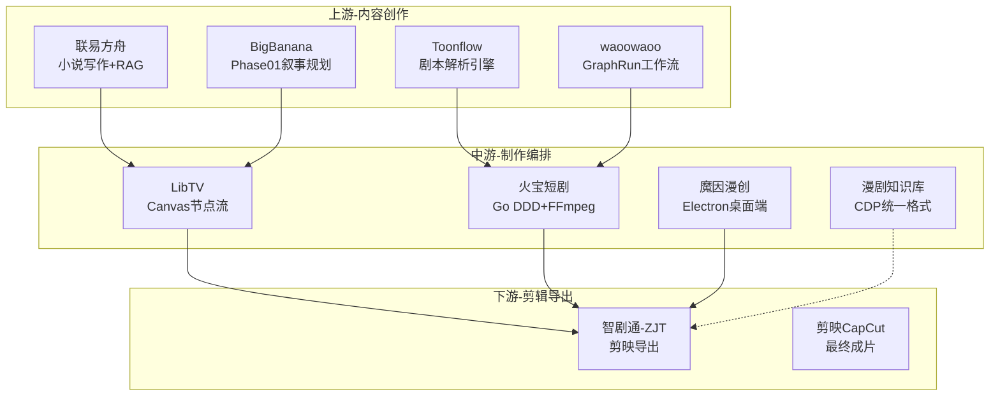

# 华哥影视 · 文件关系网

> [!info] 说明
> 本文档是华哥影视目录下所有文件的**关系图谱**，展示各模块之间的引用、上下游和技术依赖关系。
> 图谱来源：系统扫描所有 68 个 markdown 文件，分析 wikilink、wikilink 和内容引用。

---

## 一、目录结构全景

```
华哥影视/
├── AI漫剧知识库/           # 核心方法论体系（★★★漫舟执行标准）
│   ├── 00-门户/            # 入口：SOP总流程 + A级速查
│   ├── 01-制作SOP/         # 12步详细执行文档（Step00–11）
│   ├── 02-Prompt工程库/     # Prompt模板 + 失败日志
│   ├── 03-工具手册/         # Seedance手册 / Kling手册
│   ├── 06-资源索引/         # 外部工具库索引
│   └── 07-执行层/           # 工程化执行层（核心落地）
│       └── 火宝短剧架构/     # 火宝项目档案（★A级核心参考）
│
├── AI漫剧工具研究/          # 竞品深度研究
│   ├── LibTV/               # LibTV Canvas API 专项研究
│   ├── 智剧通(ZJT)/          # ZJT API 层详细拆解
│   ├── 联易方舟/             # 全链路 + 分镜 + 剧本 + 底层架构
│   └── [配置文件 ×4]        # 小说转剧本/角色三视图/任务队列/脚本生成
│
├── BigBanana-AI-Director/   # 关键帧驱动漫剧工场（归档）
├── 智剧通-ZJT/              # 智剧通独立归档（时间轴柱子系统）
├── waoowaoo/               # AI影视Studio（归档）
├── Toonflow/               # AI短剧工厂（归档）
├── 魔因漫创-MoyinCreator/   # 桌面端AI影视（归档）
├── huobao-drama/           # 火宝短剧独立归档
├── awesome-seedance/        # Seedance提示词资源库
├── 对标提示词项目拆解/      # 提示词对标研究
└── 10亿对短剧脚本数据集/   # 数据集原始资产
```

---

## 二、工具定位矩阵

| 工具 | 核心定位 | 技术栈 | 许可证 | 评级 |
|------|----------|--------|--------|------|
| [[huobao-drama/README归档]] | 短剧自动化生产平台 | Go + DDD | AGPL-3.0 | **A级** |
| [[智剧通-ZJT]] | AI短剧制作平台 | Python FastAPI | Apache 2.0 | A- |
| [[BigBanana-AI-Director]] | 关键帧驱动漫剧工场 | React 19 + IndexedDB | CC BY-NC-SA | B+ |
| [[LibTV]] | 一站式AI视频创作平台 | TypeScript + React Flow | 闭源商业 | B+ |
| [[waoowaoo]] | AI影视Studio | Next.js 15 + BullMQ | 未明确 | B |
| [[Toonflow]] | AI短剧工厂 | Electron + Express | AGPL-3.0 | B |
| [[魔因漫创-MoyinCreator]] | 桌面端AI影视工具 | Electron + React | AGPL-3.0/商业 | B |
| [[联易方舟]] | 小说→剧本→漫剧平台 | React + RAG | 闭源SaaS | B+ |

---

## 三、工作流关系图

### 3.1 制作 SOP 主链路


### 3.2 工具与 SOP 环节对应关系

| SOP 环节 | 引用工具 | 引用内容 |
|----------|----------|----------|
| [[Step03-剧本生成]] | [[联易方舟]] | CDP 数据包模板格式 |
| [[Step05-资产库构建]] | [[LibTV]] | 角色三视图规范 |
| [[Step06-分镜脚本]] | [[火宝短剧架构/项目档案]] | 双提示词策略（ImagePrompt + VideoPrompt 分离） |
| [[Step07-视觉生成]] | [[Seedance手册]] / [[Kling手册]] | 图生提示词模板 |
| [[Step08-视频生成]] | [[智剧通-ZJT]] | 视频客户端集成方案 |
| [[Step10-导出剪辑]] | [[智剧通-ZJT]] | 剪映草稿导出独占功能 |

### 3.3 工具间上下游关系



---

## 四、技术架构关系

### 4.1 技术栈依赖链

| 层级 | 技术选型 | 采用工具 |
|------|----------|----------|
| 前端框架 | React 18/19 | BigBanana、魔因漫创、Toonflow(旧) |
| | Next.js 15 | waoowaoo、LibTV |
| | Vue 3.4+ | 火宝短剧 |
| | 原生HTML/JS | 智剧通ZJT |
| 后端架构 | Go DDD | 火宝短剧 |
| | Python FastAPI | 智剧通ZJT |
| | Node.js / Electron | waoowaoo、魔因漫创、Toonflow |
| AI客户端 | Provider路由工厂 | 火宝短剧（5平台热插拔） |
| | 统一AI网关 | 智剧通ZJT（多API聚合） |
| | BullMQ队列 | waoowaoo |
| 视频处理 | FFmpeg封装 | 火宝短剧（25种xfade转场） |
| | 剪映草稿导出 | 智剧通ZJT（独家） |

### 4.2 架构模式对比

| 架构模式 | 工具 | 核心价值 |
|----------|------|----------|
| **DDD领域驱动** | [[huobao-drama/README归档]] | 最清晰分层：domain/application/infrastructure |
| **Agent智能体编排** | [[智剧通-ZJT]] | script_writer_core + 智能体协同 |
| **节点式画布** | [[LibTV]] | React Flow可视化工作流 |
| **IndexedDB前端存储** | [[BigBanana-AI-Director]] | 纯前端，数据不过后端 |
| **RAG知识库** | [[联易方舟]] | 向量检索+Prompt注入 |
| **BullMQ任务队列** | [[waoowaoo]] | 企业级异步任务管理 |

---

## 五、角色一致性方案对比

> [!tip] 一致性方案演进
> 从分散到统一：各工具独立探索 → [[联易方舟]] CDP 格式 → [[AI漫剧知识库]] 漫舟标准

| 方案 | 来源工具 | 实现方式 | 成熟度 |
|------|----------|----------|--------|
| **DNA三层锁** | 漫剧知识库 | 外貌锁+风格锁+行为锁 | 待验证 |
| **角色三视图** | LibTV/ZJT/火宝 | 正面+侧面+背面 | ★★★ |
| **九宫格定妆表** | 漫剧知识库 | 3×3多角度规范 | ★★ |
| **角色衣橱** | BigBanana | 多套造型管理 | ★★ |
| **6层身份锚点** | 魔因漫创 | 最完整的多层身份锚定 | ★★ |
| **CDP数据包** | 联易方舟/漫剧知识库 | 完整IP资产JSON Schema | **★★★** |

---

## 六、CDP 格式——事实标准

> [!important] 统一资产交换格式
> [[联易方舟]] 的 CDP JSON Schema 与 [[AI漫剧知识库]] 中的 `cdp_doc_generator_示例.md` 完全一致，已成为漫舟知识库的内部标准。

**核心 Schema**（见 [[cdp_doc_generator_示例]]）：

```json
{
  "meta": { "runId", "append", "source" },
  "settings": { "targetPlatform", "aspectRatio", "stylePreset" },
  "characters": [{ "id", "name", "aliases", "gender", "age", "appearance", "clothing", "persona" }],
  "locations": [{ "id", "name", "description", "props" }],
  "items": [{ "id", "name", "description", "appearance" }],
  "shots": [{ "id", "shotNumber", "durationSec", "locationId", "characterIds", "script", "dialogue", "imagePrompt", "videoPrompt", "objective", "action" }]
}
```

---

## 七、最佳实践索引

### 7.1 各工具最具参考价值的内容

| 工具 | 参考价值最高的内容 |
|------|-------------------|
| [[huobao-drama/README归档]] | Go DDD 分层架构 / FFmpeg 25种转场封装 / 5平台Provider路由 |
| [[智剧通-ZJT]] | 时间轴柱子系统 / 剪映草稿导出 / Agent脚本引擎 |
| [[BigBanana-AI-Director]] | 关键帧驱动思路 / 九宫格分镜预览 / 角色衣橱 |
| [[LibTV]] | Canvas节点流交互 / Agent原生集成 |
| [[waoowaoo]] | BullMQ心跳机制 / 多AI模型统一抽象层 |
| [[魔因漫创-MoyinCreator]] | GroupRefManager引用收集 / 6层角色锚点 |
| [[Toonflow]] | Segment→Shot→Cell三级分镜结构 |
| [[联易方舟]] | CDP数据包格式 / RAG知识库架构 |

### 7.2 知识库与工具引用双向关系

```
漫剧知识库 ──引用──→ 工具研究
   ↑                    │
   │                    ↓
   └─────启示────── 工具深度研究
```

**典型案例**：
- [[LibTV深度研究报告]] → 启示 [[火宝短剧架构/项目档案]] 的双入口设计
- [[联易方舟/联易方舟-漫剧制作底层架构深度研究]] → 转化为 [[cdp_doc_generator_示例]] 漫舟标准

---

## 八、文件速查表

### 核心知识库
| 文件 | 描述 |
|------|------|
| [[SOP总流程]] | 12步SOP总览入口 |
| [[A级内容速查表]] | A级内容快速定位 |
| [[火宝短剧架构/项目档案]] | ★A级，火宝项目完整档案 |
| [[cdp_doc_generator_示例]] | CDP统一格式示例 |

### 工具深度研究
| 文件 | 描述 |
|------|------|
| [[LibTV深度研究报告]] | LibTV整体分析 |
| [[LibTV-Canvas-API突破研究]] | Canvas节点API专项 |
| [[联易方舟/联易方舟-全链路架构拆解]] | 联易方舟完整架构 |
| [[联易方舟/联易方舟-漫剧制作底层架构深度研究]] | CDP格式来源 |
| [[智剧通-ZJT]] | ZJT API详细拆解 |

### 工具归档
| 文件 | 描述 |
|------|------|
| [[BigBanana-AI-Director]] | BigBanana总览 |
| [[智剧通-ZJT/时间轴柱子系统]] | ZJT核心架构创新 |
| [[huobao-drama/README归档]] | 火宝短剧独立归档入口 |
| [[waoowaoo/README归档]] | waoowaoo总览 |
| [[Toonflow/README归档]] | Toonflow总览 |
| [[魔因漫创-MoyinCreator/README归档]] | 魔因漫创总览 |

---

## 九、知识缺口与待办

- [ ] LibTV Canvas 节点的详细 API 文档研究
- [ ] waoowaoo GraphRun 工作流引擎的逆向分析
- [ ] 魔因漫创 GroupRefManager 源码级分析
- [ ] 各工具与漫剧知识库 SOP 的完整对接方案验证

---

*本图谱由 Claude Code 自动分析生成，最后更新：2026-03-28*
