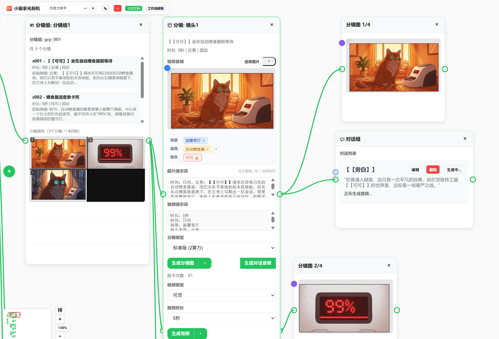
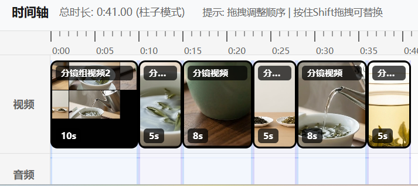
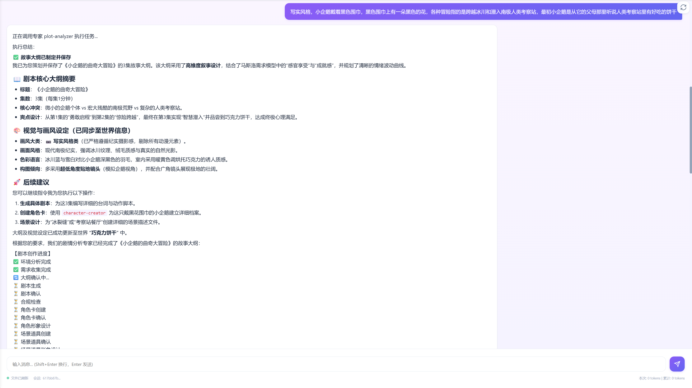
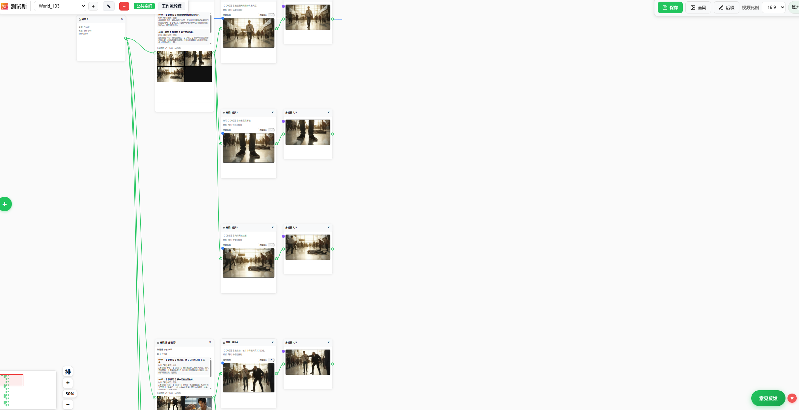

# 智剧通 ZJT（AI 短剧制作平台）

> AI 一站式短剧制作解决方案
> *AI Short Drama Production Platform*

智剧通是一个基于 AI 的短剧制作平台，提供剧本创作、角色管理、视频生成、音频合成等一站式短剧制作解决方案。已完成红果平台短剧制作与上线，视频、图片生成稳定性经真实项目检验。

## 界面展示

### 工作流总览

### 时间轴编辑

### AI 智能体生成剧本

### 无限画布创作

### 算力管理

### 实战验证：红果漫剧

## 主要功能

### 1. 全流程自动化剧本与分镜制作

实现剧本、分镜制作全流程自动化，一键拆分剧本节点、自动解析填充提示词，智能匹配场景、角色与道具；自动生成并适配多宫格分镜图，保障分镜一致性且节省算力，零基础可完成核心创作。支持配置角色形象图，确保角色跨分镜、场景形象统一，彻底解决 AI 短剧角色"脸崩"问题，大幅提升成片质感。

### 2. AI 智能体打造爆款剧本

由专业智能体团队协同运作的剧本智能体，支持对话式完成剧本新建、续写与小说改编全流程；自动完成大纲、剧本、角色、场景道具的设计生成及合规校验，操作极简。智能生成悬念钩子与情感曲线分析，精准把控观众情绪，高效提升短剧完播率。

### 3. 专业级无限画布创作

搭载兼具便捷性与专业性的无限画布，为剧本分镜创作提供灵活专业的创作空间，高效适配多宫格分镜的生成、拆分与布局，让分镜创作更专业、操作更省心。

### 4. 无界化团队协同

免安装，浏览器端直接使用；支持局域网部署与公网远程协作，团队成员随时随地实时共创。

### 5. 灵活算力与密钥管理

支持多供应商密钥配置，内置多用户独立算力计费体系，可绑定个人微信支付，适配多样创作需求。

### 6. 开箱即用零门槛

内置免费图床、精选提示词库、TTS 语音服务，无需繁琐配置，注册即可创作。

### 7. 工程级稳定可靠

全接口单元测试覆盖，系统稳定性强，保障创作过程不中断。

## 快速开始（Windows）

双击 `点我启动.exe` 即可运行：

- ✅ 系统托盘图标显示启动状态
- ✅ 服务就绪后自动打开浏览器
- ✅ 右键菜单支持：打开浏览器、查看日志、退出
- ✅ 退出时自动停止所有服务

**前端首页**：`http://localhost:9003/`

首次启动会自动创建配置文件 `config.yml`，一般无需修改。

## 开源协议

修改版 Apache License 2.0，主要条款：

- ✅ 允许商业使用
- ✅ 允许修改和分发
- ❌ 未经授权不能运营多空间服务
- ❌ 不能移除前端 LOGO 和版权信息

## 联系我们

- 📧 邮箱：jeffstric@qq.com
- 🌐 在线演示：https://ailive.perseids.cn
- 📖 完整教程：飞书文档（https://bq3mlz1jiae.feishu.cn/wiki/W1h2wCK3mi1CgDk36LEcVqggnLe）

---

© 2025 智剧通. All rights reserved.
