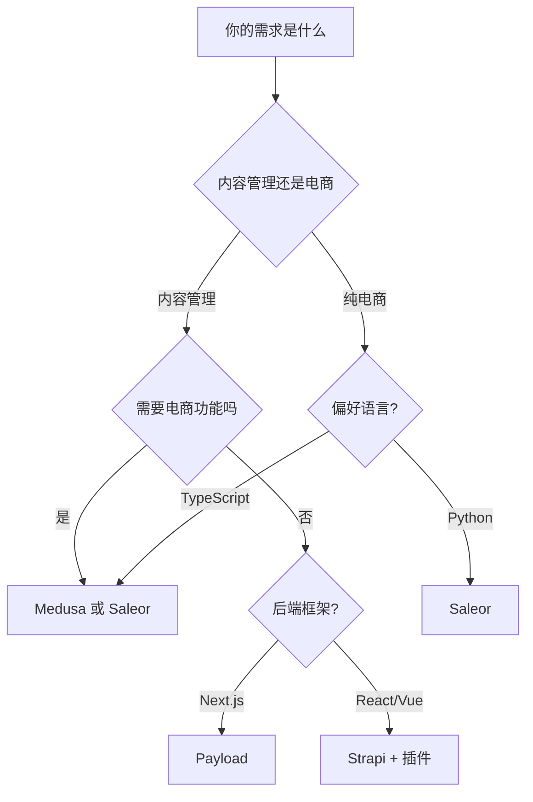

# 独立站项目总览

> [!info] 分析时间
> 2026-03-27 | 来源：GitHub 源码 + 官方文档

---

## 平台档案

| 平台 | 类型 | 语言 | 许可证 | 最新版本 |
|------|------|------|--------|----------|
| [[Medusa]] | Headless 电商引擎 | TypeScript | MIT | v2.13.5 |
| [[Strapi]] | Headless CMS | TypeScript | MIT | v5.7.0 |
| [[Saleor]] | Headless 电商平台 | Python | BSD-3 | v3.24 |
| [[Payload]] | Next.js 原生 CMS | TypeScript | SSPL | v3.80.0 |

---

## 快速选型决策树



---

## 核心对比

| 维度 | [[Medusa]] | [[Strapi]] | [[Saleor]] | [[Payload]] |
|------|-----------|-----------|-----------|-------------|
| **定位** | 电商引擎/商务模块 | 内容管理 CMS | 电商平台/GraphQL | Next.js 原生 CMS |
| **语言** | TypeScript | TypeScript | Python | TypeScript |
| **数据库** | PostgreSQL | PostgreSQL/MySQL/SQLite | PostgreSQL | MongoDB/PostgreSQL/SQLite |
| **API** | REST + GraphQL | REST + GraphQL | GraphQL Native | REST + GraphQL |
| **后台** | React Dashboard | React Admin | React Dashboard | 内置 Admin UI |
| **电商插件** | 30+ 商务模块 | 需插件生态 | 内置完整电商 | 15+ 官方插件 |
| **部署** | Docker / 云 | Docker / 云 | Docker / 云 | **Vercel/Cloudflare Workers** |
| **学习曲线** | ⭐⭐⭐ 中 | ⭐⭐ 简单 | ⭐⭐⭐⭐ 陡峭 | ⭐⭐⭐ 中 |

---

## 适用场景

| 场景 | 推荐 | 备选 |
|------|------|------|
| B2B 电商平台 | [[Saleor]] | [[Medusa]] |
| B2C 品牌独立站 | [[Medusa]] | [[Payload]] + 电商插件 |
| 内容型网站 + 博客 | [[Strapi]] | [[Payload]] |
| Next.js 全栈项目 | [[Payload]] | [[Strapi]] |
| 移动 App 后端 | [[Saleor]] | [[Medusa]] |
| 内部工具 + CMS | [[Payload]] | [[Strapi]] |
| 多语言/国际化 | [[Strapi]] / [[Saleor]] | [[Medusa]] |

---

## 技术栈全景

```
独立站技术栈
├── 电商引擎
│   ├── Medusa (TS + Turborepo)
│   └── Saleor (Python + Django + GraphQL)
├── 内容管理
│   ├── Strapi (TS + Nx monorepo)
│   └── Payload (TS + Next.js)
└── 部署平台
    ├── Vercel (Payload 原生)
    ├── Cloudflare Workers (Payload)
    ├── Docker (全部支持)
    └── 各大云厂商 (全部支持)
```

---

## 一句话总结

> [!quote]
> - **[[Medusa]]** = 模块化电商 Lego，灵活但需自己组装
> - **[[Strapi]]** = 最流行的开源 Headless CMS，内容管理首选
> - **[[Saleor]]** = 最成熟的 GraphQL 电商平台，适合大流量 B2C
> - **[[Payload]]** = Next.js 嫡系 CMS，开发体验最佳

---

## 下一步行动

- [ ] 根据业务需求选择 1-2 个平台深入研究
- [ ] 搭建 Demo 环境测试
- [ ] 评估维护成本和团队技术栈匹配度
- [ ] 制定选型报告

---

## 关联笔记

- [[Medusa/平台分析]]
- [[Strapi/平台分析]]
- [[Saleor/平台分析]]
- [[Payload/平台分析]]

---

*最后更新：2026-03-27*
